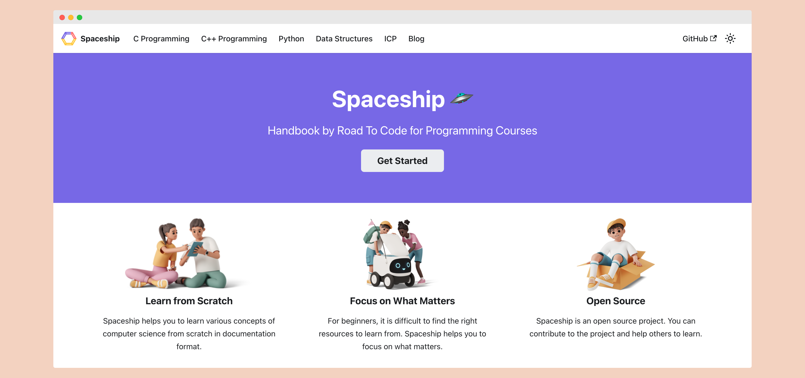

# Spaceship 🛸

Welcome to RoadToCode's Handbook!
This is a open-source project serves as a handbook for various technologies and programming languages taught in RoadToCode's courses.

Weather you are computer science student or coding enthusiast this repository will be your go to resource for all the things related to C, C++, Python, HTML, CSS, JavaScript, ReactJS, NodeJS, MongoDB and ExpressJS.

## How to Contribute

We welcome contributions from the community to help us expand and improve this handbook. If you would like to contribute, follow these steps:

1. Fork the repository to your GitHub account.
2. Make your changes, add new content, or fix any existing issues.
3. Open a new pull request in this repository.

## Contributors

Made with [contrib.rocks](https://contrib.rocks).
