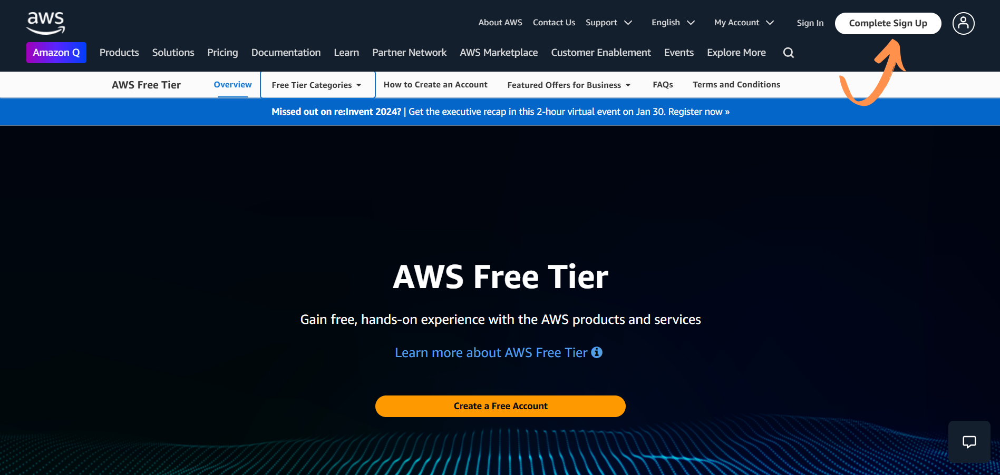
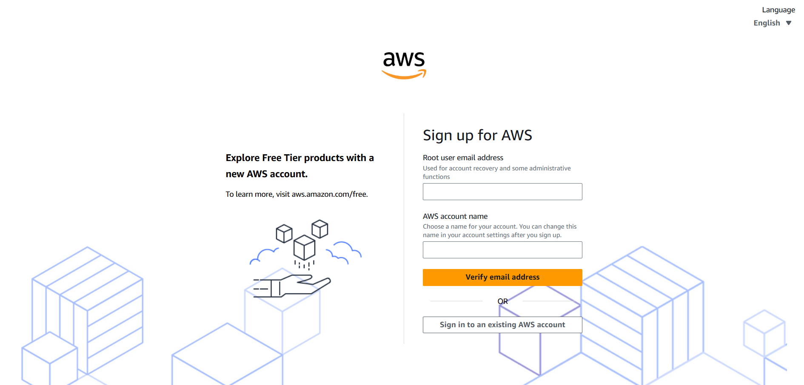
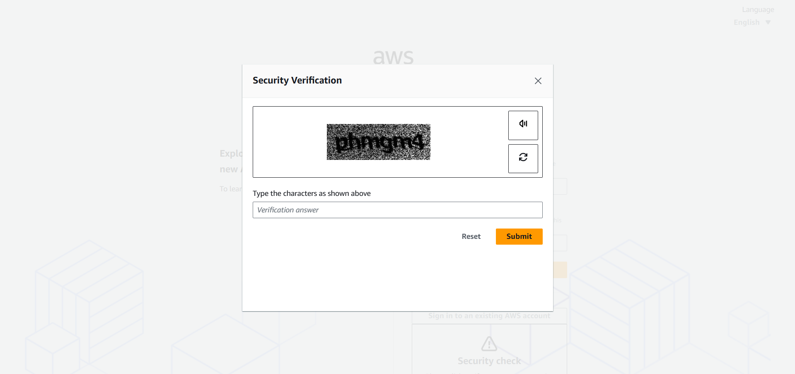
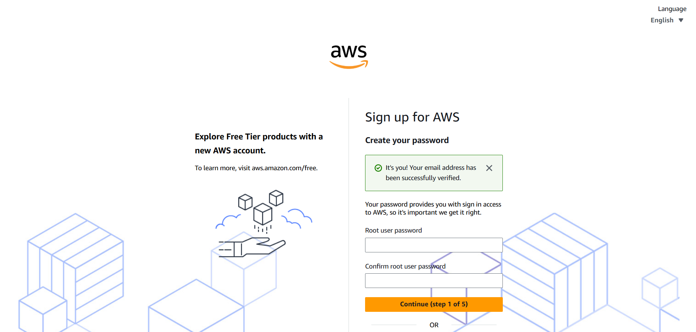
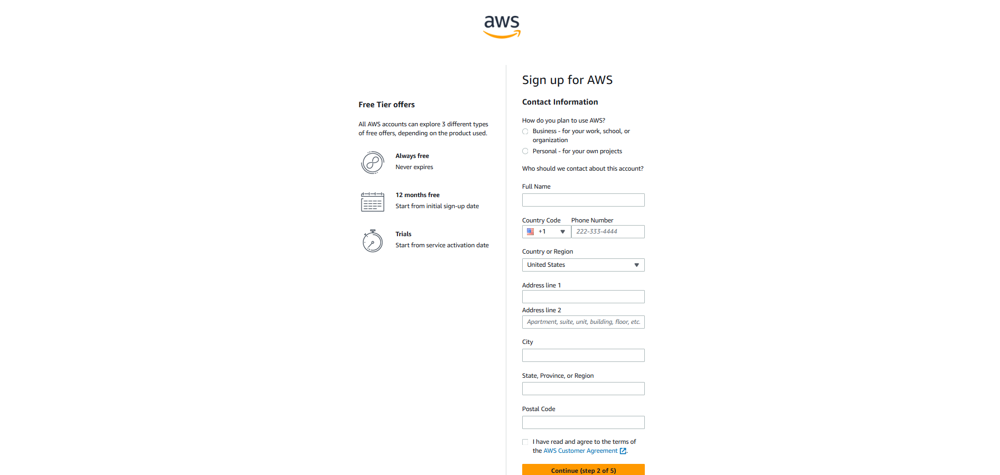
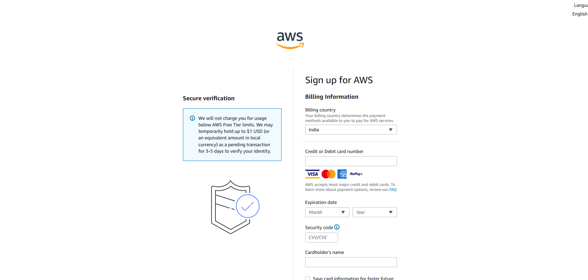

# Hello, Learners!

If you’re new to AWS or want to learn more about it, you’re in the right place! We will cover everything you need to know, using simple language and examples to make your learning experience enjoyable.

Today, let’s start by understanding the basics of AWS — what it is, important terms, and the main structure it works on. It’s like laying the foundation for our learning journey!

## How To Create an AWS Account?

Creating an AWS (Amazon Web Services) account is simple if you follow these steps carefully.

### Step 1: Go to the AWS Website

- Visit the AWS (Amazon Web Services) website by typing https://aws.amazon.com/ in your web browser.
- Click on the first link to visit the AWS official website.

### Step 2: Start Creating Your Account

- On the AWS homepage, click on the **Create an AWS Account** button. This is usually located at the top right corner.

### Step 3: Enter Your Email Address

- A registration form will appear.
- Enter your email address, choose a strong password, and give a unique account name (e.g., "My AWS Account").
- Click on **verify email address**.

- Enter capcha carefully.
  **(If you are unable to see clearly, you can click on the speaker icon and type it correctly)**

  

- create your password and conform password
  **(pass should be contain uppercase, lowercase, numeric and special character)**

### Step 4: Choose the Account Type

- Select **Personal** if you are an individual creating an account for learning or personal use.
- If you are creating the account for a company, select **Professional**.

### Step 5: Fill in Your Personal Details

- Enter your full name, phone number, and address.
- Make sure all the details are accurate.

### Step 6: Payment Information

- AWS requires a valid debit or credit card to verify your account.
- Enter your card details carefully. Don’t worry; AWS provides a free tier for beginners, so you won’t be charged unless you exceed the free usage.
- Click on **Continue**.

- Enter the OTP that you will be received on your mobile number.

### Step 7: Identity Verification

- AWS will ask you to verify your identity using your phone number.
- Enter your phone number and wait for an OTP (One-Time Password).
- Enter the OTP and click on **Verify**.

### Step 8: Select a Support Plan

- AWS will show different support plans. For beginners, choose the **Basic Support (Free)** option.
- Click on **Complete Sign-Up**.

### Step 9: Start Exploring AWS

- Once your account is created, log in to the AWS Management Console.
- You can now start exploring AWS services like EC2, S3, and more.

# Congratulations! 🎉

You have successfully completed all the steps to create your account. 🎊

We are excited to have you on board! Feel free to explore and enjoy the features we offer.

### Tip

AWS offers free tier services. Monitor your usage to avoid unexpected charges.

https://medium.com/@Vaibhavihole31/aws-structure-and-region-2ddd3f1d4884
