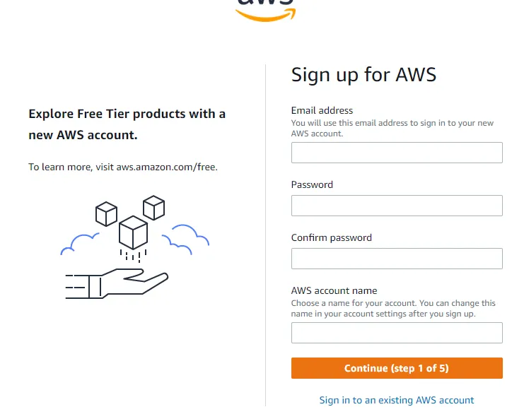

# Hello, Learners!

If you’re new to AWS or want to learn more about it, you’re in the right place! We will cover everything you need to know, using simple language and examples to make your learning experience enjoyable.

Today, let’s start by understanding the basics of AWS — what it is, important terms, and the main structure it works on. It’s like laying the foundation for our learning journey!

## How To Create an AWS Account?

Step-by-Step Guide to Creating an AWS Account:

#### Go to the AWS website

Visit the AWS (Amazon Web Services) website by typing https://aws.amazon.com/ in your web browser.

#### Click on “Create an AWS Account”

Look for the `Create an AWS Account` option on the top right corner of the website and click on it.

### Enter your details

You must provide your email address, a strong password, and a unique AWS account name. Use a valid email as this is where AWS will send important notifications.

https://medium.com/@Vaibhavihole31/aws-structure-and-region-2ddd3f1d4884
