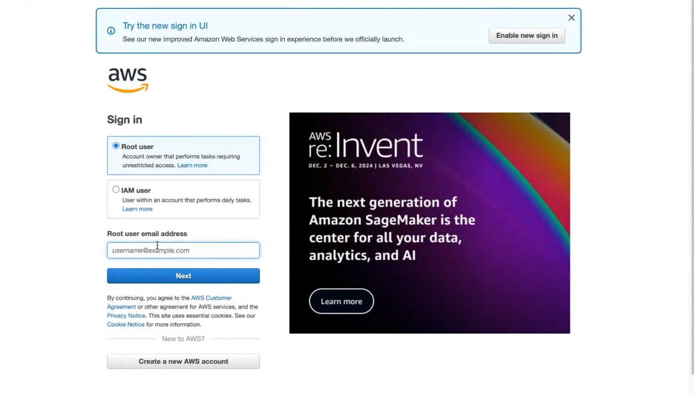
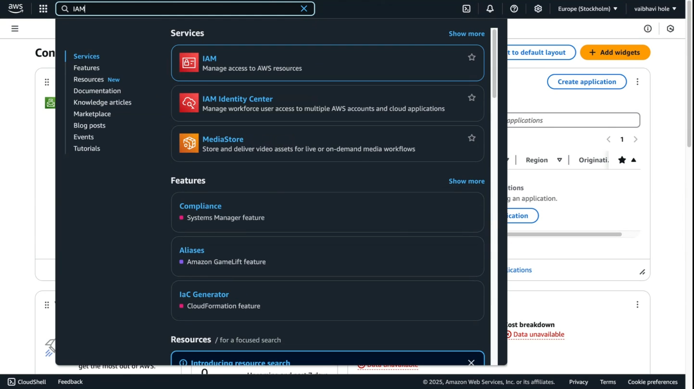
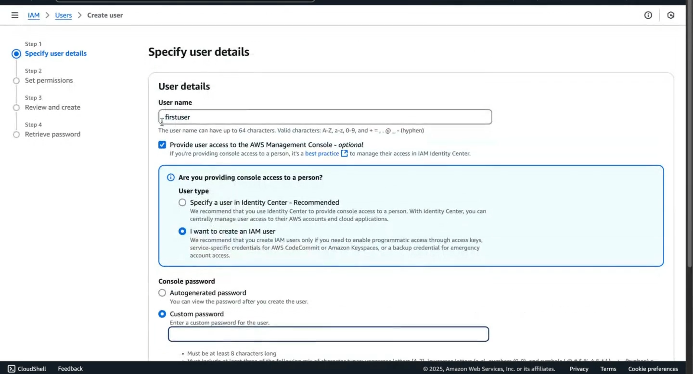

### How to create ` IAM User`?

# Step 1: Sign In to AWS Management Console

# Step 2: Search `IAM`

# Step 3: Click on `users`

# Step 4: Click on `create users`

## Step 5: Specify User Details

1.Enter a user name

2.Select i want to create IAM user

3.Set Password

## Step 6: Attach policies to user and click next buttonC

## Step 7: Review the details of the user and permissions.

## Step 8: Save IAM Credentials.

