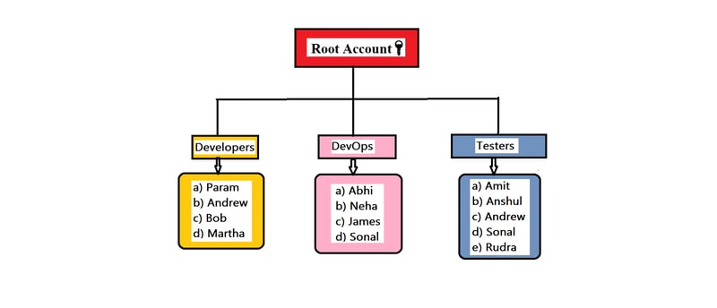
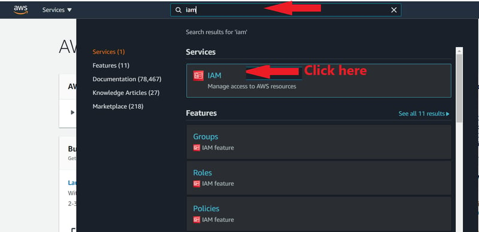
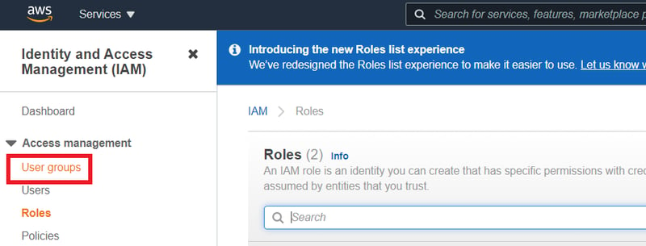
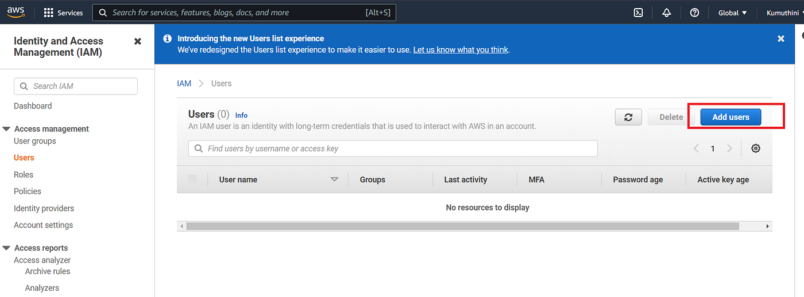
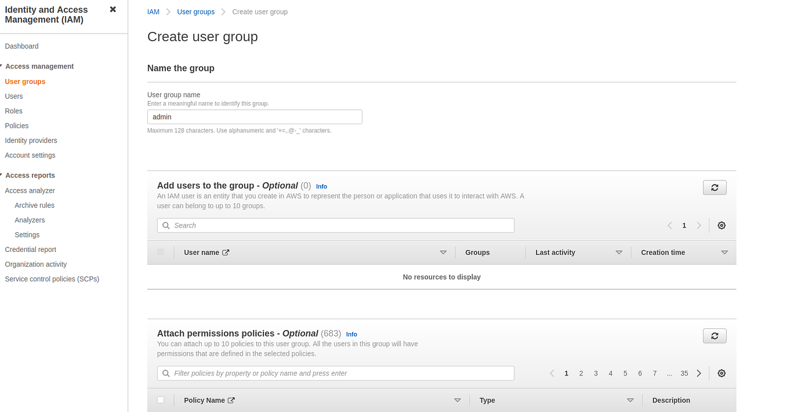
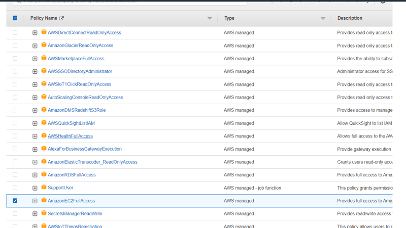
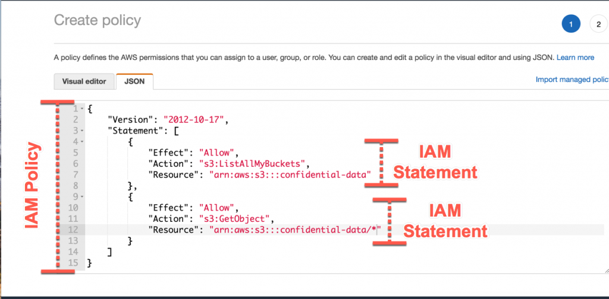
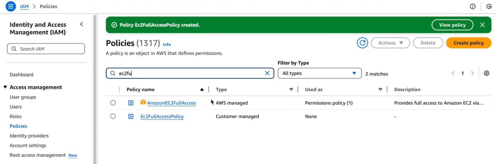
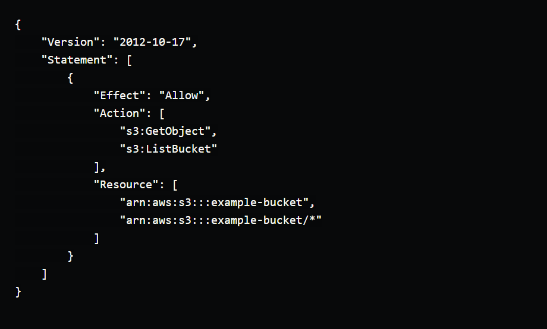
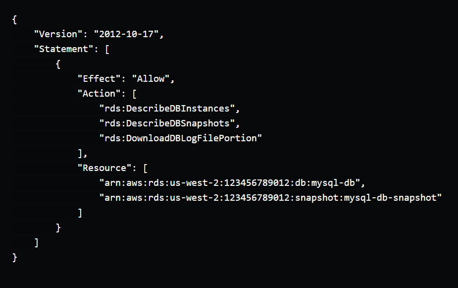

# IAM User Groups

The User group is a collection of IAM users. It let you to assign permissions for multiple users, which can make it easier to manage the permissions for those users. So, the users that require the same permissions can be grouped together.
A user group can contain many users, and these users can also belong to multiple user groups. Changes made to a group are reflected to all users within that group.

  

**Let's learn how to create IAM user groups and how to add users to groups.**

**Step 1:-**

- Open your favorite browser and navigate to AWS Login Page

- Then enter in your password and click submit. You have now successfully signed in to the AWS Management Console.
   

**Step 2:-**
In the search bar type IAM and click on IAM(Manage access to AWS resources) to navigate to IAM Dashboard.

  

**Step 3:-**
On the left side of the page, you should see an option called **Users groups.**

- Click on that option, and you will be taken to the Users groups Page
   

**Step 4:-**
Click on **Add user** button to create a user

  

**Step 5:-**

- Provide a Group name
- Select the Users who needed to be a part of the group.
- Provide any permissions from existing policies

  

  

- Scroll down and click on **Create group** button.

#### Congratulations you have created an IAM User group🤩🤩

  

# Policies in AWS

In simple terms, a **Policy** is a document that explains what permissions are allowed or denied for a user, group, or role. Policies control access to AWS resources, and they are written in **JSON** format.

#### Policies are rules that says what user and groups can do or can't do in AWS

There are three main types of policies in **AWS:**

**Managed Policies:**

- These are pre-made policies created and managed by AWS.
- They handle common use cases, like giving read-only access to a storage service.
- You can attach these policies to multiple users, groups, or roles.
- You cannot edit Managed Policies, but you can copy them and make your own custom version.

**Customer Policies:**

- These are policies created and managed by you (the user).
- They can be attached to multiple users, groups, or roles within your AWS account.
- Customer Policies give you full control over permissions.

**Inline Policies:**

- These are policies directly linked to a single user, group, or role.
- If the entity (user, group, or role) is deleted, the policy is also deleted.
- Inline Policies are useful for specific, one-off permissions.
    

### So how do we create a Policy?

- We’ll start from the AWS console, search up **IAM** and then select Policies. After that we’ll select **Create Policy.**

  

- There are two ways to create policies in the console.
- policies are essentially **JSON** documents, so we can just write it up.
- Optionally we can use the **console’s** excellent policy maker:

  

- After this step, we can add tags to make it easier to find our policy, and give it a name.

  

- So we have our policy. Now we just need to attach it to an entity
  How do we do it?
- We just need to select a user and Add Permission.

- Click on create policy.

 

## and here we done 🥳

## Examples of IAM Policies

Here are some examples of simple IAM policies for common use cases:

### Allow read-only access to an S3 bucket

This policy allows a user to read objects from the `example-bucket` S3 bucket and list the contents of the bucket, but does not allow them to upload or modify objects.

### Allow read-only access to an RDS instance

This policy allows a user to view information about the mysql-db RDS instance and download log files, but does not allow them to perform any modifications.

### Allow full access to an EC2 instance

This policy allows a user to perform any action on any EC2 instance in the account.
  

# Role in AWS

## What is an IAM Role in AWS?

#### A role is a set of permissions that defines what actions can be perform on AWS resources.

IAM roles are similar to IAM users, but with some important differences.

IAM roles are not associated with a specific user or group. Instead, they are intended to be assumed by anyone who needs the permissions associated with the role.  

#### IAM roles are a way to delegate access to AWS resources without the need to create and manage long-term AWS credentials.

For example, you might create an IAM role that grants access to an S3 bucket, and then allow a Lambda function to assume that role when it needs to access the bucket.

This way, you don't need to manage access keys for the Lambda function, and you can maintain tighter control over who has access to the S3 bucket.  

### Main Elements of an IAM Role

### Understanding AWS IAM Role Assumption

Assuming an AWS IAM Role means temporarily using the permissions and policies linked to that role. This is done through the AWS Security Token Service (STS) API, which provides temporary security credentials. These credentials include:

- Access Key
- Secret Access Key
- Security Token

**Who Can Assume a Role?**
For a user to assume a role, they must have permission, which is granted by the role's Trust Policy. This trust policy defines which users or services are allowed to assume the role.

**Ways to Assume an IAM Role**
There are different methods to assume a role in AWS:

1. AWS Management Console
2. AWS CLI (Command Line Interface)
3. AWS SDKs
4. AssumeRole API

**How Long Can You Use the Temporary Credentials?**

- The temporary credentials are valid for a limited time, known as the session duration.
- By default, this duration is set to 1 hour but can be extended to a maximum of 12 hours, depending on the role's session duration policy.

**Key Points to Remember**

- Always check the Trust Policy to confirm who can assume a role.
- Use the temporary credentials to access resources only during the valid session duration.
- Choose the right method (Console, CLI, SDK, or API) based on your requirement.

**This process is useful for managing permissions and securely accessing resources in AWS.**
  
