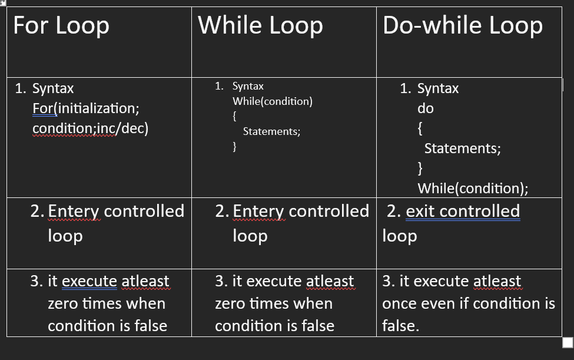

# while and do-while loop

## 2. While Loop

1. entry controlled loop
2. pre-tested
3. executes atleast zero times when condition is false .

````cpp
syntax:
2.``` while(condition)
{// loop body start

} // loop body ends
````

**Example 1 :**

```cpp showLineNumbers = "true"
#include <iostream>
using namespace std;

int main() {

    int i=1;
    while(i<=5)
    {
      cout<<i<<"\n";
      i++;
    }
     return 0;
}
```

**Output :**

> 1<br/>
> 2<br/>
> 3<br/>
> 4<br/>
> 5<br/>

**Explanation :**

In a `Line no 6` we declare one variable which name has `i` and store value `1`, datatype is `integer`. <br/>
In a `Line no 7` `while(i<=5)` `while` is keyword, check condition `i<=5`. <br/>
In a `Line no 8` Start body of while loop .<br/>
In a `Line no 9` print `i` variable using `cout` `\n` is used to new line. <br/>
In a `Line no 10` increase value of `i` by one.<br/>
In a `Line no 11` ends body of while loop .<br/>

**Example 2 :**

```cpp showLineNumbers = "true"
#include <iostream>
using namespace std;

int main() {

    int i=0;
    int n;

    cout<<"Enter n :"<<"\n";
    cin>>n;
    while(i<n)
    {
      cout<<i<<"\n";
      i++;
    }
     return 0;
}
```

**Output :**

> 0<br/>
> 2<br/>
> 3<br/>
> .<br/>
> .<br/>
> .<br/>
> 9<br/>

**Explanation :**

In a `Line no 6` we declare one variable which name has `i` and store value `1`, datatype is `integer`. <br/>
In a `Line no 7` we declare another variable which name has `n`.<br/>
In a `Line no 9` `Enter n :` from user.<br/>
In a `Line no 10` store value of `n` variable using `cin` object.<br/>
In a `Line no 11` `while(i<=5)` `while` is keyword, check condition `i<=5`. <br/>
In a `Line no 12` Start body of while loop .<br/>
In a `Line no 13` print `i` variable using `cout` `\n` is used to new line. <br/>
In a `Line no 14` increase value of `i` by one.<br/>
In a `Line no 15` ends body of while loop .<br/>

**Example 3 :**

```cpp showLineNumbers = "true"
#include <iostream>
using namespace std;

int main() {

    int n;
    cout<<"Enter value of n: ";
    cin>>n;

    int i=1;
    while(i<=n)
    {
      cout<<i<<endl;
      i++;
    }
     return 0;
}
```

**Output :**

> Enter value of n: 25<br/>
> 1<br/>
> 2<br/>
> 3<br/>
> .<br/>
> .<br/>
> .<br/>
> 25<br/>

**Explanation :**

In a `Line no 6` we declare one variable which name has `i` and store value `1`, datatype is `integer`. <br/>
In a `Line no 7` we declare another variable which name has `n`.<br/>
In a `Line no 9` `Enter n :` from user.<br/>
In a `Line no 10` store value of `n` variable using `cin` object.<br/>
In a `Line no 11` `while(i<=5)` `while` is keyword, check condition `i<=5`. <br/>
In a `Line no 12` Start body of while loop .<br/>
In a `Line no 13` print `i` variable using `cout` `\n` is used to new line. <br/>
In a `Line no 14` increase value of `i` by one.<br/>
In a `Line no 15` ends body of while loop .<br/>

## 3. do-while loop :

1. exit controlled loop
2. post tested
3. it executes atleast once even if condition is false .

````cpp
syntax:
3. do
{//  start

   [example]

} //  ends
while(condition);


**Example 4 :**

```cpp showLineNumbers = "true"
#include <iostream>
using namespace std;

int main() {

    int i=10;
    do
    {
      cout<<i<<"\n";
      i++;
    }
    while(i<=5);

    return 0;
}
````

**Output :**

> 10

**Explanation :**

In a `Line no 6` we declare one variable which name has `i` and store value `10`, datatype is `integer`. <br/>
In a `Line no 7` `do` is a keyword.<br/>
In a `Line no 8` Start body of do-while loop .<br/>
In a `Line no 9` print `i` variable using `cout` `\n` is used to new line. <br/>
In a `Line no 10 increase value of `i`by one.<br/>
In a`Line no 11`ends body of while loop .<br/>
In a`Line no 12` `while(i<=5)` `while`is keyword, check condition`i<=5`. <br/>

**Example 5 :**

```cpp showLineNumbers = "true"
#include <iostream>
using namespace std;

int main() {

    int i=10;
    do
    {
      cout<<i<<"\n";
      i++;
    }
    while(i<=10);

    return 0;
}
```

**Output :**

> 1<br/>
> 2<br/>
> 3<br/>
> 4<br/>
> .<br/>
> .<br/>
> 10<br/>

**Explanation :**

In a `Line no 6` we declare one variable which name has `i` and store value `10`, datatype is `integer`. <br/>
In a `Line no 7` `do` is a keyword.<br/>
In a `Line no 8` Start body of do-while loop .<br/>
In a `Line no 9` print `i` variable using `cout` `\n` is used to new line. <br/>
In a `Line no 10 increase value of `i`by one.<br/>
In a`Line no 11`ends body of while loop .<br/>
In a`Line no 12` `while(i<=5)` `while`is keyword, check condition`i<=5`. <br/>

**Example 6 : WAP to simulate video game menu**<br/>
1---> New Game<br/>
2---> Resume<br/>
3---> Settings<br/>
4---> Exit<br/>

```cpp showLineNumbers = "true"
#include <iostream>
using namespace std;

int main() {

    int choice = -1;
    char ch= 'y';

    do
    {
      cout<<"####### Video Game #######"<< endl;
      cout<<"1 => New Game : "<<endl;
      cout<<"2 => Resume : "<<endl;
      cout<<"3 => Settings : "<<endl;
      cin>>choice;

      if(choice == 1)
      {
        cout<<"New game is starting...";
      }
      else if(choice == 2)
      {
        cout<<"Continue from where you left...";
      }
      else if(choice == 3)
      {
        cout<<"Select Settings...";
      }
      cout<<"\n\n Do you want to continue ? (y/n)";
      cin>>ch;
    }
    while(ch == 'y');

    return 0;
}
```

**Output :**

> ####### Video Game #######<br/>
> 1 => New Game<br/>
> 2 => Resume<br/>
> 3 => Settings<br/>
> 1<br/>
> New game is starting...<br/><br/>
> Do you want to continue ? (y/n)y<br/>
> ####### Video Game #######<br/>
> 1 => New Game<br/>
> 2 => Resume<br/>
> 3 => Settings<br/>
> 2<br/>
> Continue from where you left..."<br/><br/>
> Do you want to continue ? (y/n)y<br/>
> ####### Video Game #######<br/>
> 1 => New Game<br/>
> 2 => Resume<br/>
> 3 => Settings<br/>
> 3<br/>
> Select Settings...<br/><br/>
> Do you want to continue ? (y/n)n<br/>

**Difference between for, while, do-while loop :**


