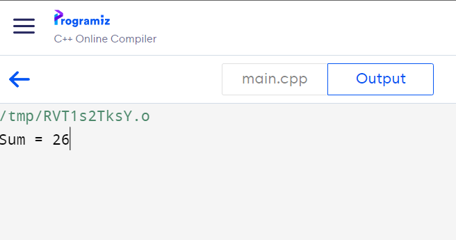
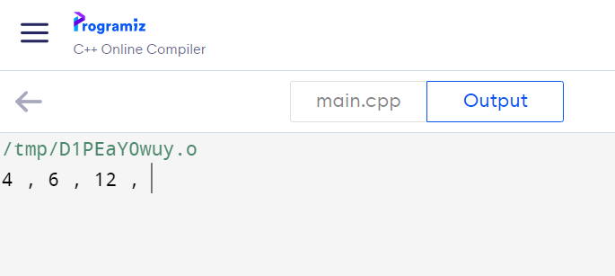
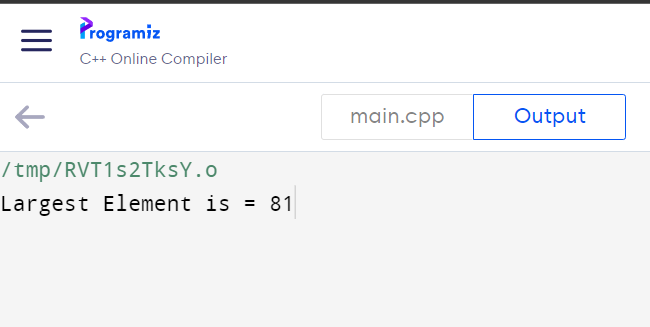

# Array Example

1. Write a program to calculate sum of elements present in array.

```cpp
#include <iostream>
using namespace std;

int main() {

    int arr[5] = {5,4,1,9,7};

    int sum = 0;

    for(int i=0; i<5; i++)
    {
        sum = sum + arr[i];
    }

    cout<<"Sum = "<<sum;

    return 0;
}
```



2. Write a program to print only even numbers from given array

```cpp
#include <iostream>
using namespace std;

int main() {

    int arr[8] = {5,4,1,9,7,6,12,3};

    for(int i=0; i<8; i++)
    {
        if(arr[i]%2==0)
        {
            cout<<arr[i]<<" , ";
        }
    }


    return 0;
}
```



3. Write a program to find largest element from array.

```cpp
#include <iostream>
using namespace std;

int main() {

    int arr[5] = {5,7,81,2,23};

    int largest = 0;

    for(int i=1; i<5; i++)

    {
        if(arr[i] > largest)
        {
            largest = arr[i];
        }
    }

    cout<<"Largest Element is = "<<largest;

    return 0;
}
```


