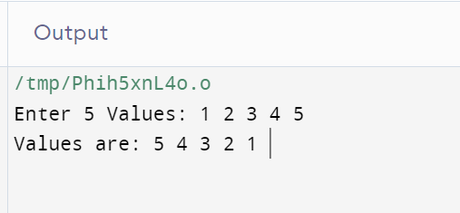
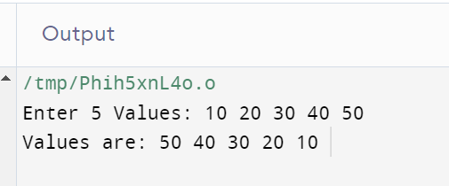

# Reverse an Array

### How to Reverse an Array

**Example :**

```cpp
#include <iostream>
using namespace std;
int main() {

    int arr[5];
    cout<<"Enter 5 Values: ";
    for(int i=0; i<5; i++)
    {
        cin>>arr[i];
    }

    cout<<"\n Values are: ";
    for(int i=4; i>=0; i--)
    {
        cout<<arr[i]<<" ";
    }

    return 0;
}
```

**Output :**



**Example :**

```cpp
#include <iostream>
using namespace std;
int main() {

    int arr[5];
    cout<<"Enter 5 Values: ";
    for(int i=0; i<5; i++)
    {
        cin>>arr[i];
    }

    int start=0;
    int end=4;

    for(int i=0; i<3; i++)
    {
        int temp = arr[start];
        arr[start] = arr[end];
        arr[end] = temp;

        start++;
        end--;
    }

    cout<<"\n Values are: ";
    for(int i=0; i<5; i++)
    {
        cout<<arr[i]<<" ";
    }

    return 0;
}
```

**Output :**


