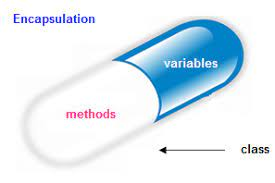

## Introduction to OOPs

### OOPs :

OOP stands for Object-Oriented Programming. Its aims to implement real-life entities like inheritance, data-hiding, polymorphism, etc in programming.

**Advantages :**

1. Security
2. Scaling
3. standard practices for SD

```
real life entities
1. Google meet
2. ATM Machine
3. Payment
4. RTC
```

### Pillars of OOPs

- Encapsulation
- Abstraction
- Polymorphism
- Inheritance.

**Encapsulation :**

Putting related data & function at one place.



<br />

**Abstraction :**

Abstraction displays only necessary things and hide details information about how it is implemented.

<br />

**Polymorphism :**

Polymorphism as the ability of a message to be displayed in more than one form.

Poly means many & morphism means forms

<br />

**Inheritance :**

Inheritance is a mechanism of reusing and extending existing classes without modifying them.
