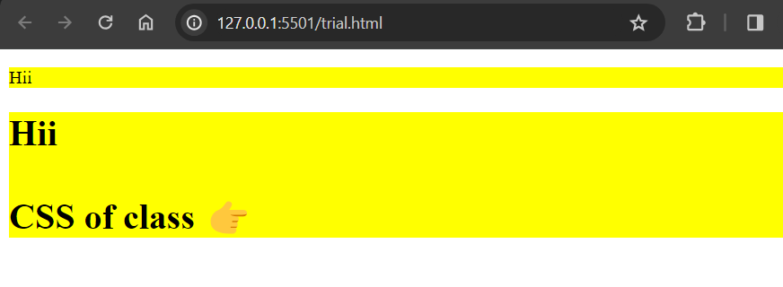

# Introduction To CSS

### CSS

CSS stands for Cascading Style Sheets. It is used to design webpages and control the visual appearance of HTML elements. CSS describes how HTML elements should be displayed on different devices, such as desktops, laptops, tablets, or other media.

## CSS Selectors :

CSS selectors are used to select HTML elements that you want to style. There are different types of CSS selectors:

**There are three types of selectors:**

1. **Tagname Selector:** Tagname selector selects HTML elements based on their tag names. For example, h1, h2, p, etc.

```html
<h1>Hii</h1>

CSS of h1 tag 👉

<style>
  h1 {
    color: red;
  }
</style>
```


2. **Class Selector :**
   The class selector selects elements based on their class attribute. It is denoted by a dot (.) followed by the class name.

## Selectors in CSS

### 1. Tagname

Tagname selector select attribute by tag for example `h1`,`h2`,`p`...

```html
<h1>Hii</h1>

CSS of h1 tag 👉

<style>
  h1 {
    color: red;
  }
</style>
```


### 2. Classname

The `.class` selector selects elements with a specific class attribute.

```html
  <p class="highlight"> Hii </p>
  <h1 class="highlight"> Hii  </p>

   CSS of class 👉

   <style>
      .highlight{
          background-color : yellow
      }
  </style>
```



3. **ID Selector :** The ID selector selects elements based on their ID attribute. It is denoted by a hash (#) followed by the ID name

```html
<h1 id="myheading">Hii</h1>

CSS of myheading id 👉

<style>
  #myheading {
    color: red;
  }
</style>
```


### Height, Width For Button

CSS provides various methods to specify the height and width of an image. To set image dimensions using pixel (px) values, you can use CSS, which allows for precise control over the size of the image.

**Example :**

```html
<!DOCTYPE html>
<html>
  <head>
    <title>Height And Width</title>
    <style>
      #btn-recording {
        background-color: #99c2ff;
      }
      #btn-presenting {
        background-color: #3385ff;
        color: white;
      }
      .google-btn {
        height: 40px;
        width: 120px;
      }
    </style>
  </head>
  <body>
    <button id="btn-recording" class="google-btn">Start Recording</button>
    <br /><br />
    <button id="btn-presenting" class="google-btn">Start Presenting</button>
  </body>
</html>
```

**Output :**


