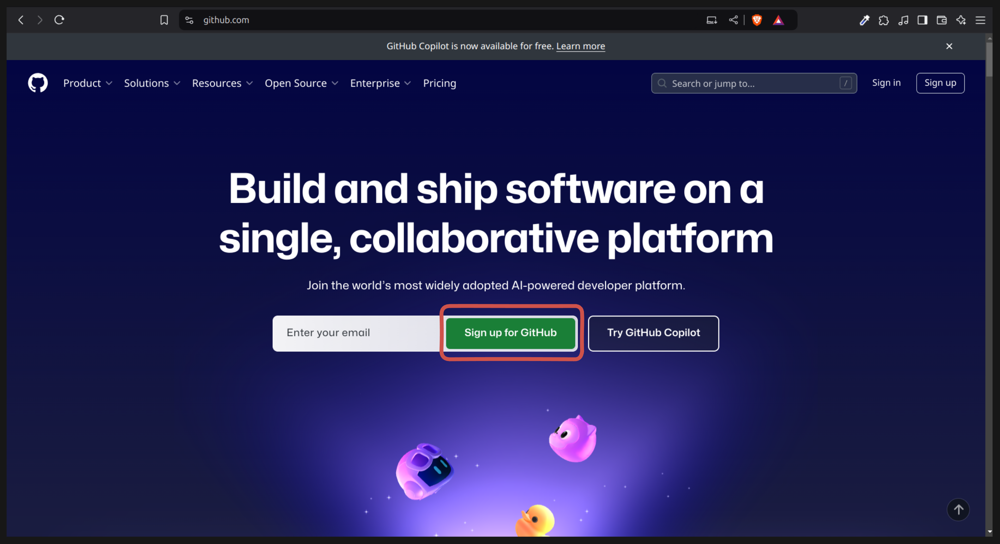
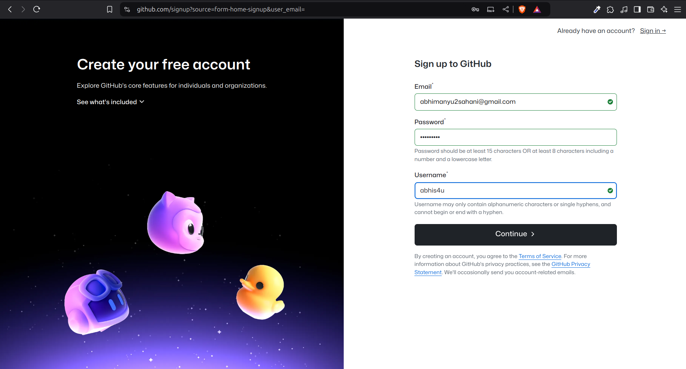
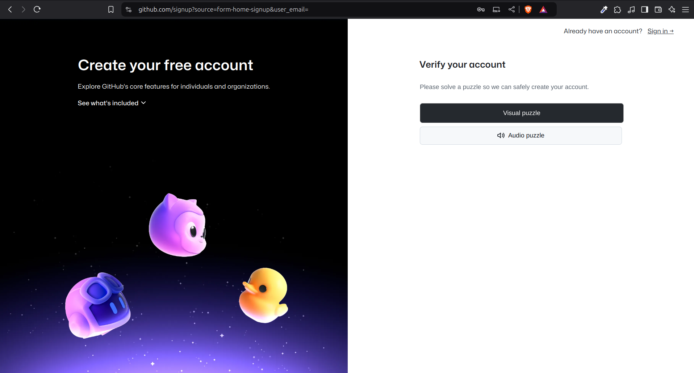
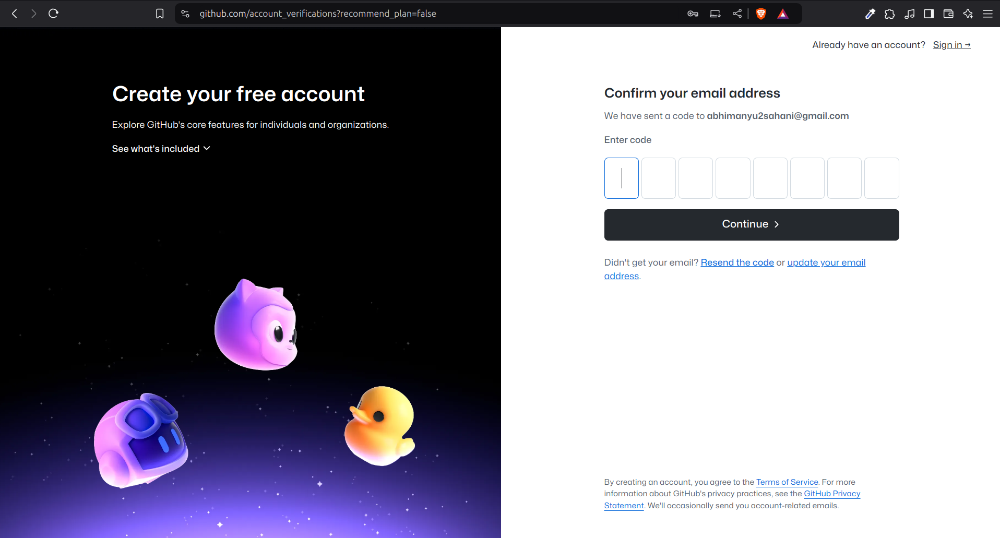
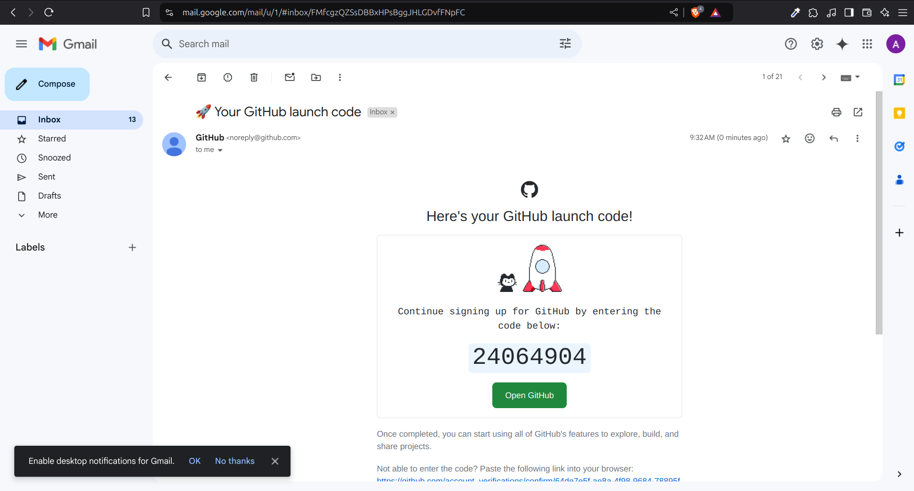
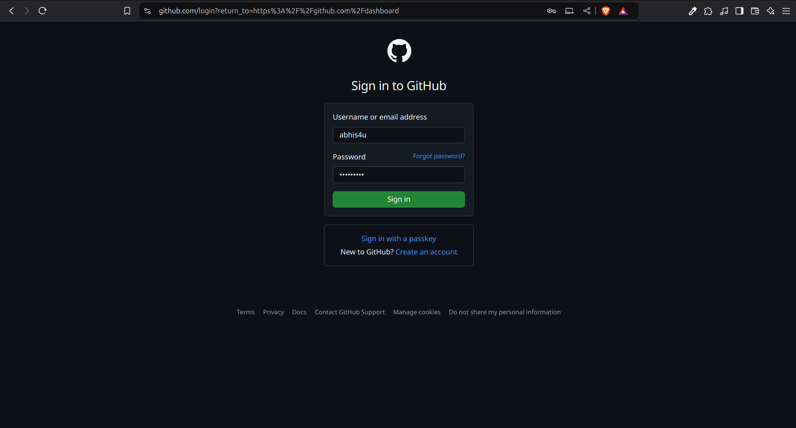
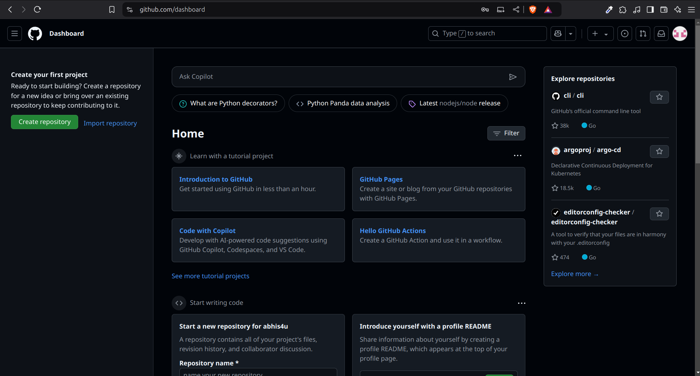
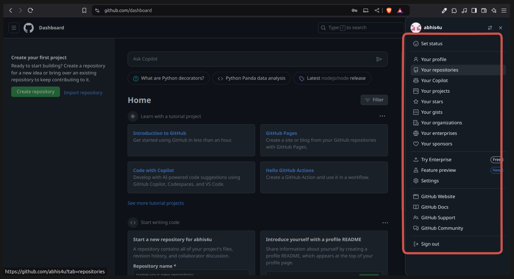

# 🌐 Introduction to GitHub

GitHub is a popular platform that allows developers to **store, manage, and share their code online**.  
It works together with **Git**, a version control system that tracks changes in your code.  
With GitHub, you can collaborate with others, contribute to open-source projects, and showcase your work to employers or classmates.

Think of GitHub as a **social network for developers** — instead of sharing photos or posts, you share **projects and code**.  
It helps you:

- Store your code safely in the cloud ☁️
- Work on the same project with others without file confusion 🔄
- Track who made what changes and when 🧠
- Build a portfolio of your coding work 💼

---

# 🧭 How to Create a GitHub Account

Creating a **GitHub account** is your first step to becoming part of the global developer community.  
Follow these simple steps to set up your account and start using GitHub.

---

## 🪜 Step 1: Visit the GitHub Website

Go to [https://github.com/](https://github.com/)

---

## 🪜 Step 2: Click on “Sign up for GitHub”

On the homepage, click the **Sign up for GitHub** button.

---

## 🪜 Step 3: Fill in Your Details

You’ll be taken to the **Sign up** page.  
Enter the following details:

- **Email address**
- **Password**
- **Username**

Then click on the **Continue** button.

---

## 🪜 Step 4: Verify Your Account

GitHub will ask you to verify that you’re a real person.  
You can choose one of the two options:

- **Visual puzzle**
- **Audio puzzle**

Here, we’ll use the **Visual puzzle** option.

---

## 🪜 Step 5: Complete the Puzzle

Match the directions shown in the image and click **Submit**.

---

## 🪜 Step 6: Verify Your Email

Next, you’ll see the **Email verification** page.

Check your email inbox for a verification email from GitHub.  
Enter the verification code you received.

---

## 🪜 Step 7: Sign In to Your Account

Once your email is verified, GitHub will take you to the **Login page**.  
Enter your **Username** and **Password**, then click on **Sign in**.

---

## 🪜 Step 8: Welcome to Your GitHub Dashboard 🎉

You’ve successfully created your GitHub account!  
You’ll now see your **Dashboard**, where you can create repositories, explore other projects, and manage your profile.

---

## 🪜 Step 9: Open Your Profile

Click your **profile picture** in the top-right corner to access your account settings, repositories, and activity.

---

🎉 **Congratulations!**  
You’ve successfully created your GitHub account.

Now you’re ready to:

- Create and upload your first project
- Explore open-source repositories
- Collaborate with classmates or developers
