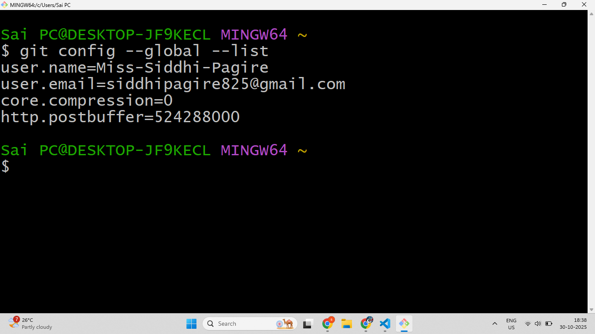

# 🔗 How to Connect Git Software and GitHub Account

Git and GitHub work best when they are connected.  
Connecting them helps you **save your projects online**, **work with others**, and **keep your code safe**.

You can think of:

- **Git** as your personal notebook where you make and save code changes locally (on your computer).
- **GitHub** as your online locker where you upload and share those projects with others.

---

## 🧩 Why Do We Connect Git and GitHub?

When you install Git and create a GitHub account, they don’t automatically know about each other.  
You have to connect them so that:

- Git knows **who you are** when you make changes 🧠
- GitHub can check that **you are the owner** of the code 🔒
- Your commits (saved work) are **linked to your GitHub profile** 🧾

---

# ⚙️ Steps to Connect Git with GitHub

Follow these simple steps to connect Git and GitHub on your computer.

---

## 🪜 Step 1: Open Git Bash

Open **Git Bash** on your computer.  
This is a command window where you’ll type the setup commands.

---

## 🪜 Step 2: Set Your GitHub Username

Type this command to tell Git your GitHub username:

```bash
git config --global user.name "YourGitHubUsername"
```

➡️ Replace `"YourGitHubUsername"` with your real GitHub username.

**Example:**

```bash
git config --global user.name "RoadToCode"
```

---

## 🪜 Step 3: Set Your GitHub Email

Now, tell Git which email you used to create your GitHub account:

```bash
git config --global user.email "your-email@example.com"
```

➡️ Replace `"your-email@example.com"` with your GitHub email.

**Example:**

```bash
git config --global user.email "roadtocode@example.com"
```

---

## 🪜 Step 4: Check if the Connection Worked

You can check if Git saved your details correctly by typing:

```bash
git config --global --list
```

You should see something like this:



✅ **If you see your username and email, your Git is now connected to your GitHub account! 🎉**

---

🎯 **Great job! You’ve connected Git with GitHub.**
Now you can create repositories, upload code, and start collaborating easily! 🚀
