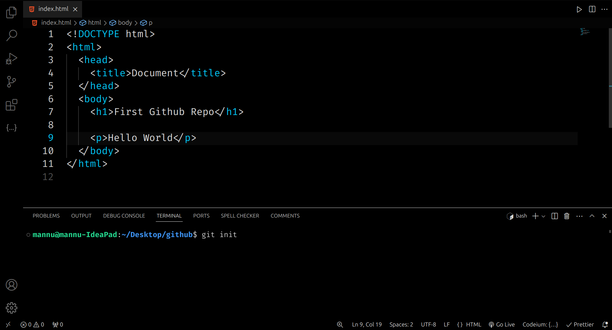
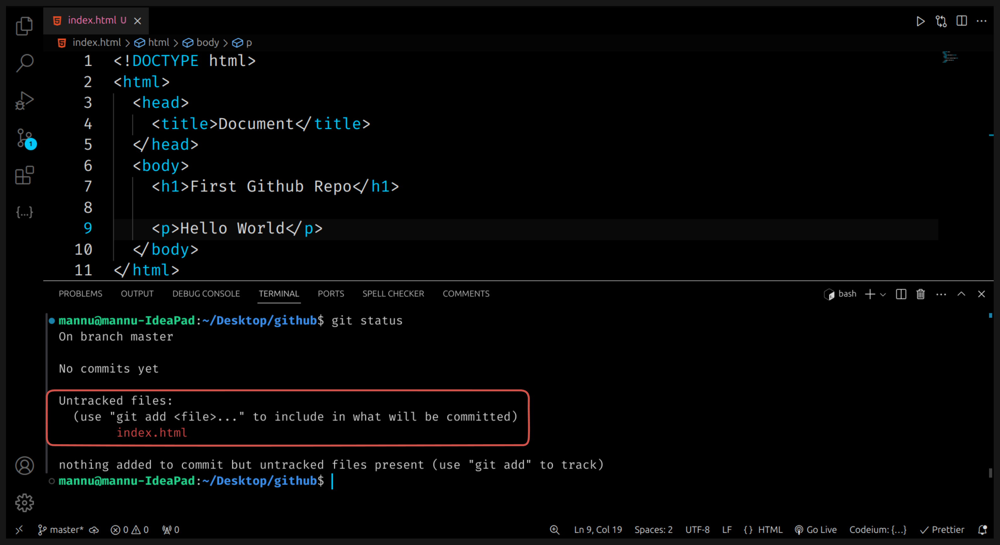
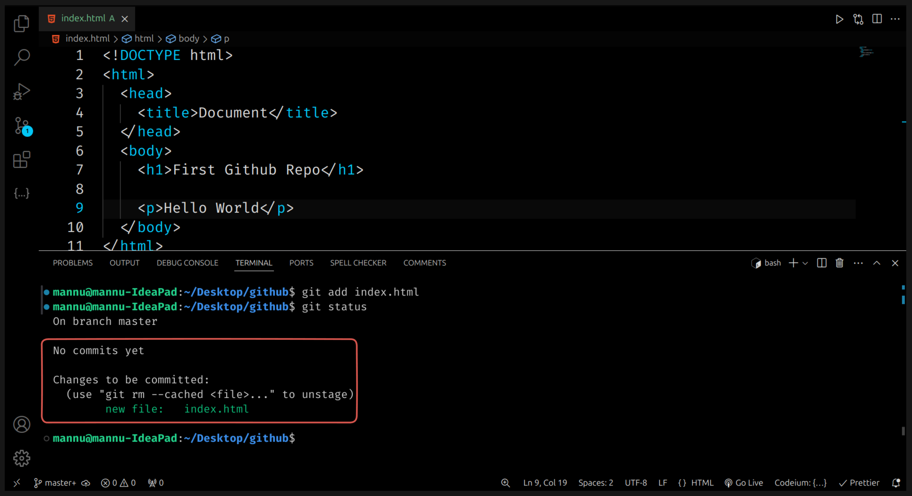
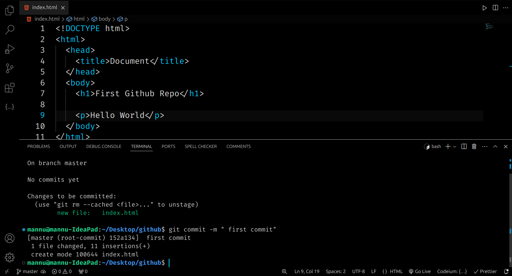
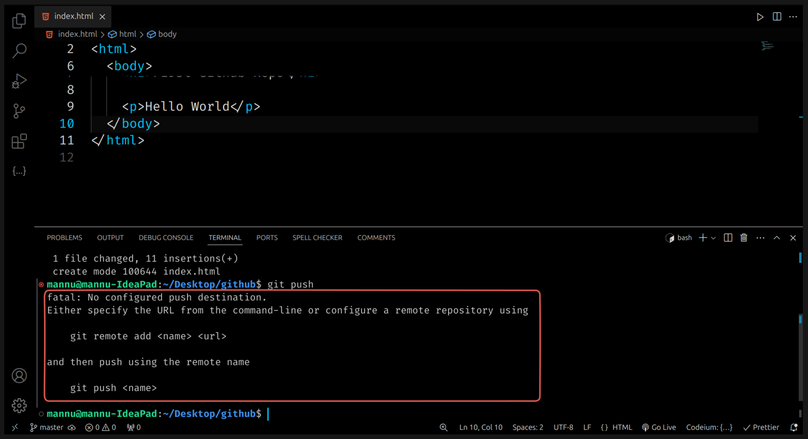
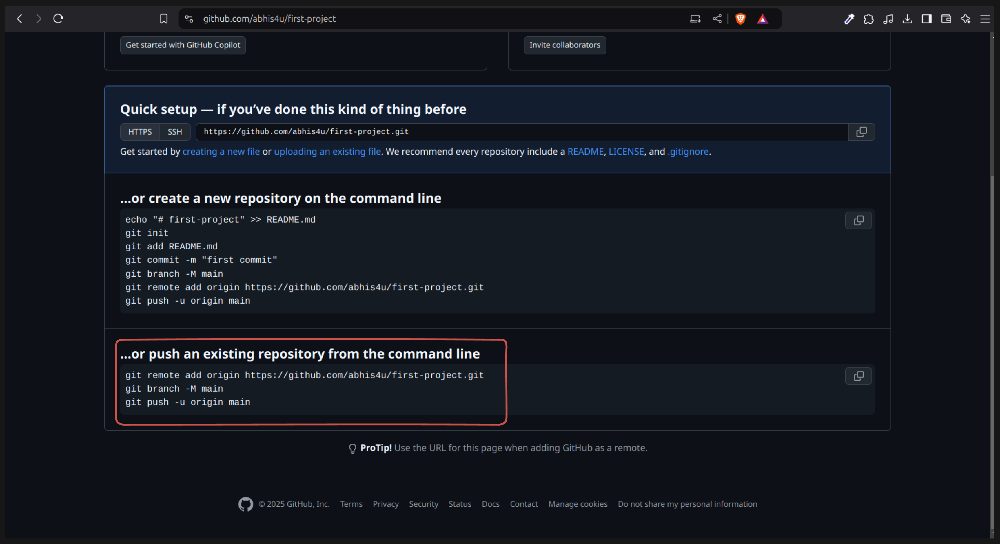
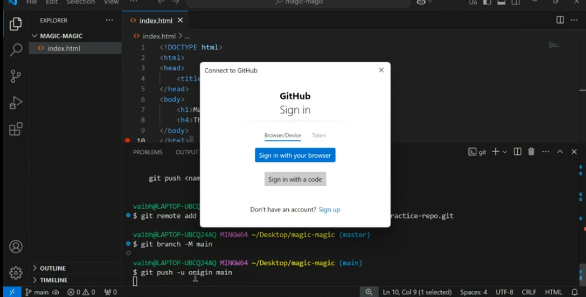
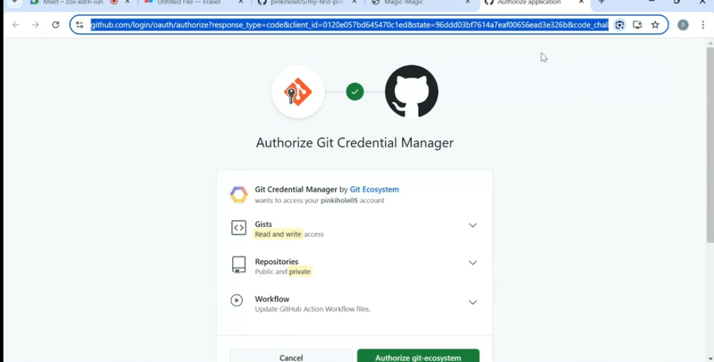

# 💻 Git and GitHub Commands

Git and GitHub are powerful tools that help you **save your code**, **track changes**, and **share your projects online**.  
This guide will help you understand and use the most common commands — step by step and in simple words.

---

## 🧠 What is Git and GitHub?

- **Git** → A software that helps you **track changes** in your code on your computer.
- **GitHub** → A website where you can **store your Git projects online** and share them with others.

---

## 🪜 Step 1: Open Your Project Folder

Go to the folder where your project is saved.  
Right-click inside the folder and choose **"Open Git Bash here"**  
(or open the terminal in **VS Code** if you use it).

---

## 🪜 Step 2: Initialize Git (Start Tracking Your Project)

This command tells Git to start watching your folder for changes.

```bash
git init
```

📝 **Note:** You only need to run this command **once per project**.
After this, Git will create a hidden `.git` folder — that means Git is now working in your project.



---

## 🪜 Step 3: Check the Status of Your Files

See which files are new, changed, or ready to be uploaded.

```bash
git status
```

- **Red text** → new or changed files (not added yet)
- **Green text** → files ready to be saved (staged)



---

## 🪜 Step 4: Add Files to Git

Before saving, you must tell Git which files you want to include.

```bash
git add .
```

✅ The `.` means **add all files**.

You can also add just one file like this:

```bash
git add index.html
```

Now, if you run `git status` again — the files should turn **green**.



---

## 🪜 Step 5: Save Your Work (Commit)

When your files are ready, you can **commit** them.
A commit means saving a snapshot of your project with a small message.

```bash
git commit -m "First commit"
```

💡 Always write a short message in quotes explaining what you changed.



---

## 🪜 Step 6: Push Your Code to GitHub

Now it’s time to **upload your local project to GitHub** so it appears on your GitHub account.  
We use the **`git push`** command for that.

---

### 🔹 What does `git push` do?

The `git push` command sends (or uploads) your saved code changes from your computer to your GitHub repository (online).

> ⚠️ Before using `git push`, make sure you have already **connected your local folder** to your **GitHub repository** using  
> `git remote add origin "your-repository-link"`.
>
> If you skip this step, Git will show a warning and your code won’t be uploaded.



---

### 🪜 Step 6.1: Go Back to Your GitHub Repository

After creating your repository on GitHub, you’ll see two sections on the page:

1. **“…or create a new repository on the command line.”**
2. **“…or push an existing repository from the command line.”**

👉 Choose the **second option** (push an existing repository) and copy the commands shown there.



---

### 🪜 Step 6.2: Run These Commands One by One

#### 1️⃣ Connect your local folder to GitHub

```bash
git remote add origin "your-repository-link"
```

This command connects your project folder on your computer to your GitHub repository.
(Replace `"your-repository-link"` with the actual link of your repo.)

---

#### 2️⃣ Rename your main branch (optional but recommended)

```bash
git branch -M main
```

Git used to call the main branch **master**,
but now GitHub and most tools use **main** instead.
This command renames it to keep everything consistent.

---

#### 3️⃣ Upload your project to GitHub

```bash
git push -u origin main
```

This command actually uploads all your commits (saved changes) to your GitHub repository.
Once this runs successfully, your project will appear online 🎉

---

### 🟡 **Are you doing all these steps for the first time?**

If yes, don’t worry! 😊  
You might see a pop-up window asking you to **sign in to your GitHub account**.  
Simply click on **“Sign in with your browser”** to continue.

1. Click **Sign in with your browser**



2. Then click **Authorize Git Credential Manager** in your browser.



✅ After signing in, your code will be uploaded to GitHub!

## 🎯 Common Git Commands

| Command                       | What It Does                               |
| ----------------------------- | ------------------------------------------ |
| `git init`                    | Start a new Git repository (**only once**) |
| `git status`                  | Check which files are changed or new       |
| `git add .`                   | Add all files to be saved                  |
| `git commit -m "message"`     | Save your changes with a message           |
| `git remote add origin <url>` | Connect your local project to GitHub       |
| `git branch -M main`          | Rename main branch                         |
| `git push -u origin main`     | Upload code to GitHub                      |
| `git pull`                    | Get latest updates from GitHub             |
| `git log`                     | Show all commits done so far               |

---

## 🎉 Congratulations!

You’ve learned the basic Git and GitHub commands!
Now you can easily upload your projects online and keep track of your work.

Whenever you make changes, just repeat these three commands:

```bash
git add .
git commit -m "Updated project"
git push
```

## Your GitHub will always stay up to date 🚀
