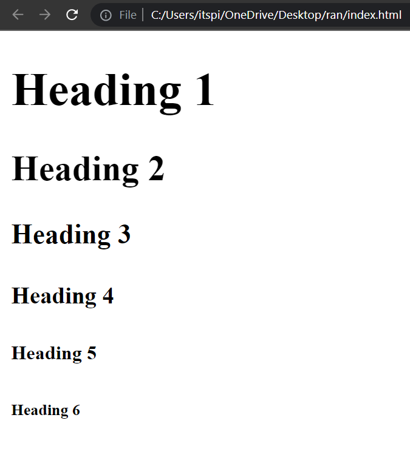
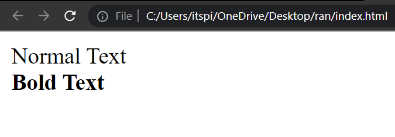
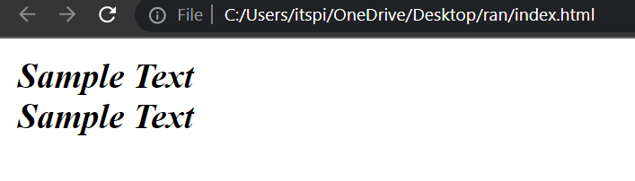
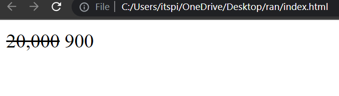
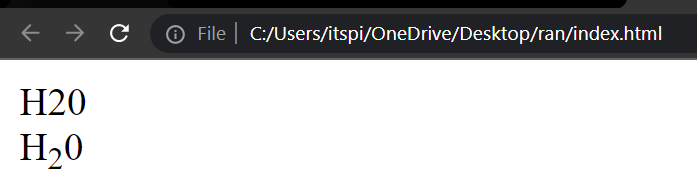

# Heading Tags

### Whitespace

Whitespace means empty space around the content of a page. You can Give Multiple spaces in your HTML code but By default, HTML is Considered only one single space. The browser ignores whitespace.

**Example:**

```html
<!DOCTYPE html>
<html>
    <head>
        <title>Basic Tags</title>
    </head>
    <body>
        Hello Students👋, Good          Evening
    </body>
</html>
```

**Output:**




### Manually Add Spaces in HTML Code

If you can Manually add empty spaces in your HTML code then you can use one Special Character **```&nbsp;```** . **```&nbsp;```** means Non-breaking Space. If you write 5 spaces in your code, the browser will remove them. To add empty spaces manually to your code, you can use the **```&nbsp;```** special character. 
 
**Example:**

```html
<!DOCTYPE html>
<html>
    <head>
        <title>Basic Tags</title>
    </head>
    <body>
        Hello Students👋, Good &nbsp; &nbsp; &nbsp; &nbsp; &nbsp; Evening
    </body>
</html>
```
**Output:**


### HTML **```<br>```** Tag

**```<br>```** : Break Row

This tag is used for break row. We don't need to close **```<br>```** because it is an empty tag. we can close **```<br/>```** like this.


 ### Based On Opening & Closing Tag There are 2 Type

1. **Empty Tag** 

Some HTML tags have no content like **```<br>```** tag these type of tags are called empty Tag.  Empty Tag do not need to close tag. 


2. **Container Tag** 

 A container tag is an HTML tag with both an opening and closing tag. For Example, **```<b></b>```** , **```<body></body>```**

## Heading tag in HTML

 In HTML, headings are titles or subtitles used to display on a webpage. There are six heading Tags. These Tags are **```<h1>,<h2>,<h3>,<h4>,<h5>,<h6>```**.  **```<h1>```** is the biggest, and **```<h6>```** is the smallest. Heading is always start from new line.
 
**Example:**

```html
<!DOCTYPE html>
<html>
    <head>
      <title>Basic Tags</title>
    </head>
    <body>
      <h1> Heading 1 </h1>
      <h2> Heading 2 </h2>
      <h3> Heading 3 </h3>
      <h4> Heading 4 </h4>
      <h5> Heading 5 </h5>
      <h6> Heading 6 </h6>
    </body>
</html>
```
**Output :**

 


### Bold Tag

In HTML **```<b>```** tag defines bold text.

**syntax :**

```html
<b>Bold Text</b>
```
**💻Example :**
```html
<!Doctype html>
<html>
    <head>
        <title>Basic Tags</title>
    </head>
    <body>
        Normal Text <br/>
        <b>Bold Text</b>
    </body>

</html>
```
**⚙️ Output :**

 


## Italic Tag

In HTML **```<i>```** tag defines Italic text.

**Syntax :**

```html
<i>Text</i>
```
**💻Example :**
```html
<!Doctype html>
<html>
    <head>
        <title>Basic Tags</title>
    </head>
    <body>
      Normal Text <br/>
      <i>Italic Text</i>
  </body>
</html>
```
**⚙️ Output :**


### Nested Tags

```html
<i><b>Sample Text</b></i>
OR
<b><i>Sample Text</i></b>
```

**Example :**

```html
<!Doctype html>
<html>
    <head>
        <title>Basic Tags</title>
    </head>
    <body>
      <i><b>Sample Text</b></i><br/>
      <b><i>Sample Text</i></b>
  </body>
</html>
```

**output :**


## Underline Tag

In HTML **```<u>```** tag are used to underline a text.

**Syntax :**

```html
<u>Underline Text</u>
```
**💻Example :**
```html
<!Doctype html>
<html>
    <head>
        <title>Basic Tags</title>
    </head>
    <body>
      Normal Text <br/>
      <u>This is underline Text</u>
  </body>
</html>
```
**Output :**


### Delete Tag

It is used to mark a portion of text which has been deleted from the document.

```html
<del>Delete Text</del>
```
**💻Example :**
```html
<!Doctype html>
<html>
    <head>
        <title>Basic Tags</title>
    </head>
    <body>
      <del>20,000</del> 900
  </body>
</html>
```
**⚙️ Output :**




### Superscript

Superscript is a number or letter that written above the normal text.

**Syntax :**

```html
10<sup>th</sup>
```
**💻Example :**
```html
<!Doctype html>
<html>
    <head>
        <title>Basic Tags</title>
    </head>
    <body>
      10th<br/>
      10<sup>th</sup><br/>
  </body>
</html>
```
**⚙️ Output :**


## Subscript

Subscript is a number or letter that written below the normal text.

```html
H<sub>2</sub>O

```
**💻Example :**

```html
<!Doctype html>
<html>
    <head>
        <title>Basic Tags</title>
    </head>
    <body>
      H20<br/>
      H<sub>2</sub>0
  </body>
</html>
```
**⚙️ Output :**



