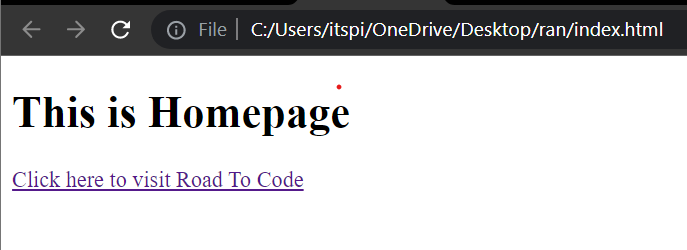

# Anchor Tag

## Anchor Tag

The anchor tag used to give a hyperlink, which is used to link from one page to another.

**Syntax**

 ```html
 <a href = "url">
    Text
 </a>
 ```

 **href** 👉 hyperlink reference

 **💻Example :**
```html
<!DOCTYPE html>
<html>
<head>
    <title>Home</title>
</head>
<body>
    <h1>This is Homepage</h1>

    <a href="https://www.roadtocode.org/">
        Click here to visit Road To Code
    </a>
</body>
</html>
```
**Output :**



 **💻Example :**

 **File Name : homepage.html**

 ```html
<!DOCTYPE html>
<html>
<head>
    <title>Home Page</title>
</head>
<body>
    <h1>This is Home page</h1>
    <a href="./aboutpage.html">
        Click here to visit about page
    </a>
    <br/> <br/>
    <a href="./contactpage.html">
        Click here to visit Contact page
    </a>
</body>
</html>
 ```
 **File Name : aboutpage.html**

 ```html
<!DOCTYPE html>
<html>
<head>
    <title>About Page</title>
</head>
<body>
    <h1>This is About page</h1>
    <a href="./contactpage.html">
        Click here to visit Contact page
    </a> 
    <br/> <br/>
    <a href="./homepage.html">
        Click here to visit home page
    </a>
</body>
</html>
 ```

 **File Name : contactpage.html**


```html
<!DOCTYPE html>
<html>
<head>
    <title>Contact Page</title>
</head>
<body>
    <h1>This is Contact page</h1>
    <a href="./homepage.html">
        Click here to visit home page
    </a>
    <br/> <br/>
    <a href="./aboutpage.html">
        Click here to visit about page
    </a>
</body>
</html>
```
**Output homepage.html**


**Output aboutpage.html**


**Output contactpage.html**


**Using Anchor Tag Open Mail Address :**

**Syntax**

 ```html
 <a href = "mailto: Mail">
    Text
 </a>
 ```

**Example :**

```html

<!Doctype html>
<html>

<head>
    <title>Anchor Tag </title>
</head>

<body>
    <a href="mailto:suraj@roadtocode.org">
        Send mail to Suraj
    </a>
</body>
</html>
```

**Output :**


**Add a Clickable Telephone using Anchor Tag :**

**Syntax**

 ```html
 <a href = "tel: Number">
    Text
 </a>
 ```

**Example :**

```html
<!Doctype html>
<html>

<head>
    <title>Anchor Tag </title>
</head>

<body>
    <a href="tel:+918805803087">
        click here to call us
    </a>
</body>
</html>
```

**Output :**


