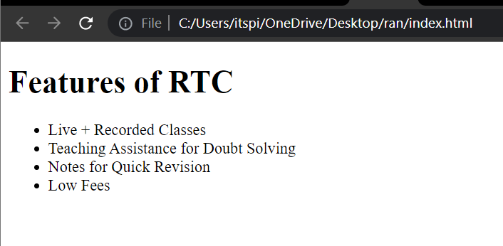
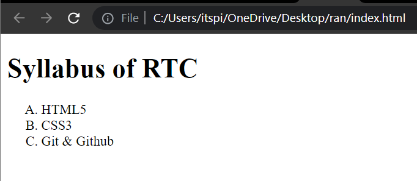

# Unordered List & Ordered List

### There are two types of list in HTML

### Unordered List

Unordered list used to create a list of related items which have no specific order or sequence.

```<ul>``` stands for Unordered list

**Syntax :**

```html
<ul>
    <li>list1</li>
    <li>list2</li>
    <li>list3</li>
</ul>
```

**💻Example :**
```html
<!DOCTYPE html>
<html>
<head>
   <title>Unorder List</title>
</head>
<body>
   <h1>Features of RTC</h1>

   <ul>
      <li>Live + Recorded Classes</li>
      <li>Teaching Assistance for Doubt Solving</li>
      <li>Notes for Quick Revision</li>
      <li>Low Fees</li>
   </ul>
</body>
</html>
```

**⚙️ Output :**

 

### Types

>**disc:** This list item will be marked as bullet small black circles (default).

>**circle:** This list item will be marked to a circle.

>**square:**	This list item will be marked as square.

**Syntax :**

```html
<ul type="circle">
    <li>list1</li>
    <li>list2</li>
    <li>list3</li>
</ul>
```

**💻Example :**
```html
<!DOCTYPE html>
<html>
<head>
   <title>Unorder List</title>
</head>
<body>
   <h1>Features of RTC</h1>

   <ul type="circle"> 
      <li>Live + Recorded Classes</li>
      <li>Teaching Assistance for Doubt Solving</li>
      <li>Notes for Quick Revision</li>
      <li>Low Fees</li>
   </ul>
</body>
</html>
```
**⚙️ Output :**

 

**💻Example :**
```html
<!DOCTYPE html>
<html>
<head>
   <title>Unorder List</title>
</head>
<body>
   <h1>Features of RTC</h1>

   <ul type="square"> 
      <li>Live + Recorded Classes</li>
      <li>Teaching Assistance for Doubt Solving</li>
      <li>Notes for Quick Revision</li>
      <li>Low Fees</li>
   </ul>
</body>
</html>
```
**⚙️ Output :**

 

### Ordered List

Ordered list used to create a list of related items which have specific order or sequence.

```<ol>``` stands for ordered list

Example :

1. 1, 2, 3, 4,....,
2. a, b, c, d,....,
3. A, B, C, D,....,
4. I, II, III, IV,....,
5. i, ii, iii, iv,.....


**💻Syntax :**
```html
<ol>
    <li>list Item 1</li>
    <li>list Item 2</li>
    <li>list Item 3</li>
</ol>
```

**💻Example :**
```html
<!DOCTYPE html>
<html>
<head>
   <title>Ordered List</title>
</head>
<body>
   <h1>Syllabus of RTC</h1>

   <ol> 
      <li>HTML5</li>
      <li>CSS3</li>
      <li>Git & Github</li>
   </ol>
</body>
</html>
```
**⚙️ Output :**

 

### Types 

>**type="1"**	It defines the list items in number.This is the default value.

**💻Example :**
```html
<!DOCTYPE html>
<html>
<head>
   <title>Ordered List</title>
</head>
<body>
   <h1>Syllabus of RTC</h1>

   <ol type="1"> 
      <li>HTML5</li>
      <li>CSS3</li>
      <li>Git & Github</li>
   </ol>
</body>
</html>
```
**⚙️ Output :**

 

>**type="A"** It defines the list items in alphabetically ordered Capital Letter.

**💻Example :**
```html
<!DOCTYPE html>
<html>
<head>
   <title>Ordered List</title>
</head>
<body>
   <h1>Syllabus of RTC</h1>

   <ol type="A"> 
      <li>HTML5</li>
      <li>CSS3</li>
      <li>Git & Github</li>
   </ol>
</body>
</html>
```
**⚙️ Output :**

 

>**type="a"** It defines list items in alphabetically ordered lowercase letters.

>**type="I"**  It Defines list items in Uppercase roman number order.

>**type="i"** It Defines list items in lower roman number order.

## Start

We can start the list at a specific point then you can use the start type it accepts a particular position to start the list. Start always accepting numbers.

**💻Syntax :**

```html
<ol type="a" start="3">
```

**💻Example :**
```html
<!DOCTYPE html>
<html>
<head>
   <title>Ordered List</title>
</head>
<body>
   <h1>Pending Syllabus</h1>

   <ol type="A" start="2"> 
      <li>CSS3</li>
      <li>Git & Github</li>
      <li>Bootstrap</li>
   </ol>
</body>
</html>
```
**⚙️ Output :**


