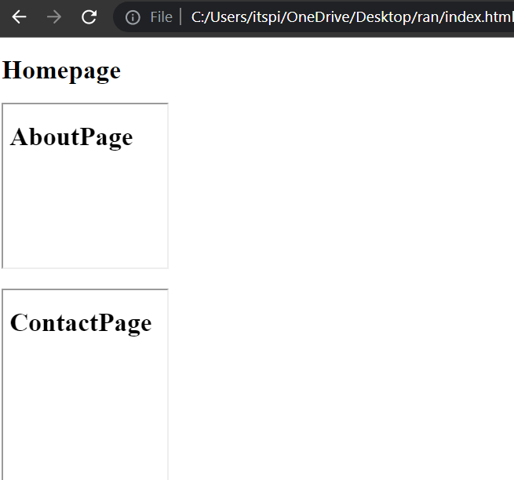
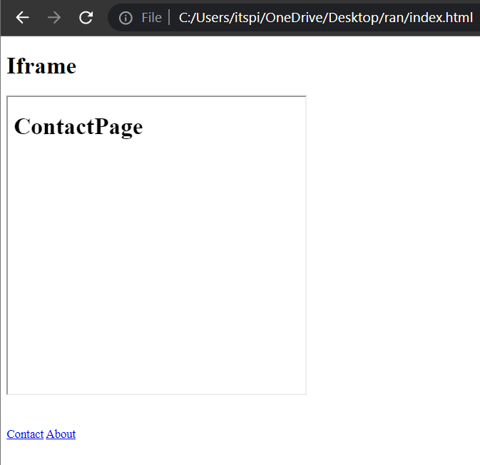
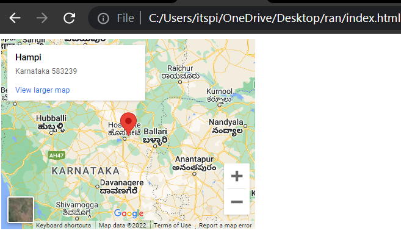

# Iframe 

 Iframe is used to embed another Html content from other sources or other webpage.

**Syntax :**

```html
<iframe
src= " "
height= " "
width= " " 
>
</iframe>
```

**💻Example :**
```html
<!DOCTYPE html>
<html >
<head>
    <title> Iframe </title>
</head>
<body>
    <h1> Homepage</h1>
    <iframe src="about.html" height="300px" width="300px">
    </iframe>
</body>
</html>
```
**⚙️ Output :**

 

**💻Example :**

```html
<!DOCTYPE html>
<html >
<head>
    <title> Iframe </title>
</head>
<body>
    <h1> Homepage</h1>
    <iframe src="about.html" height="200px" width="200px"></iframe> <br/> <br/>

    <iframe src="contact.html" height="400px" width="200px"></iframe>
</body>
</html>
```
**⚙️ Output :**




## Target Attribute 

Target attribute are used to a name or a keyword that indicates where to display the content.

### ```target= "_blank"``` Attribute

Target _blank attribute are used to opens the linked document in a new tab.


**💻Example :**

```html
<!DOCTYPE html>
<html >
<head>
    <title> iframe </title>
</head>
<body>
    <h1> Iframe</h1>
   <iframe src="" height="400px" width="400px" name="myscreen">

   </iframe>

   <br/><br/><br/>

   <a href = "contact.html" target="myscreen" >Contact</a>
   <a href = "about.html" target="myscreen">About</a>
</body>
</html>
```
**⚙️ Output :**



## Video 

**💻Example :**
```html
<!DOCTYPE html>
<html >
<head>
    <title> iframe </title>
</head>
<body>
   <iframe width="560" height="315" src="https://www.youtube.com/embed/ER9SspLe4Hg" title="YouTube video player" frameborder="0" allow="accelerometer; autoplay; clipboard-write; encrypted-media; gyroscope; picture-in-picture" allowfullscreen></iframe>
</body>
</html>
```
**⚙️ Output :**


## Map

**💻Example :**
```html
<!DOCTYPE html>
<html >
<head>
    <title> iframe </title>
</head>
<body>
    <iframe src="https://www.google.com/maps/embed?pb=!1m18!1m12!1m3!1d1980777.5606954987!2d75.94750721102605!3d14.153364207152547!2m3!1f0!2f0!3f0!3m2!1i1024!2i768!4f13.1!3m3!1m2!1s0x3bb77fd95d4be823%3A0x6e52e05076df36b8!2sHampi%2C%20Karnataka%20583239!5e0!3m2!1sen!2sin!4v1660835732262!5m2!1sen!2sin" width="400" height="300" style="border:0;" allowfullscreen="" loading="lazy" referrerpolicy="no-referrer-when-downgrade"></iframe>
</body>
</html>
```
**⚙️ Output :**




## Embed 

Embed tag are used to open non html content like pdf file.

**Syntax :**

```html
<embed src="" />
```

**Example :**

```html
<!DOCTYPE html>
<html >
<head>
    <title> iframe </title>
</head>
<body>
<embed src="Homework-3.pdf" type="application/pdf" height="300px" width="300px"/>
</body>
</html>
```

**⚙️ Output :**

