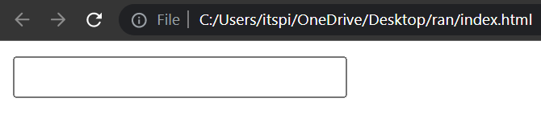
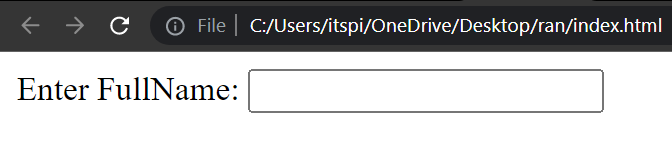
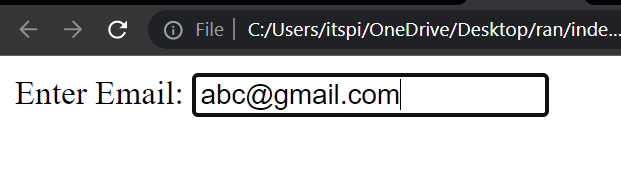
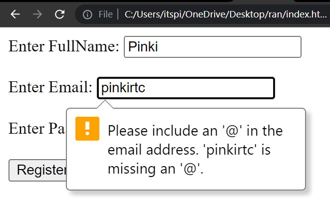
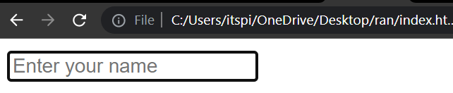
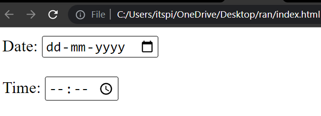

# Forms

Form is an HTML element which is used to take input from user.

```html
<form> => form start
</form> => form end
```

```html
<input type = "text"/> =>input field

type => attribute
```


### How to take input from user

**💻Example :**

```html
<!DOCTYPE html>
<html>
<head>
    <title>Form</title>
</head>
<body>
    <form>
        <input type="text" />
    </form>
</body>
</html>
```
**⚙️ Output :**

 

### Label 

**💻Example :**

```html
<!DOCTYPE html>
<html>
<head>
    <title>Forms</title>
</head>
<body>
    <form>
        <label for="inputFullName">Enter FullName: </label> 
        <input type="text" id="inputFullName"/>
    </form>
</body>
</html>
```
**⚙️ Output :**

 


### Password

Password is attribute which is invisible to the user in password field.

**💻Example :**

```html
<!DOCTYPE html>
<html>
<head>
    <title>Forms</title>
</head>
<body>
    <form>
        <label for="inputPassword">Enter Password:</label>
        <input type="password" id="inputPassword"/>
    </form>
</body>
</html>
```
**⚙️ Output :**

 

### Email

The email Attribute is used to validates the text for correct email address. You must use `@` and `.` in this field.

**💻Example :**

```html
<!DOCTYPE html>
<html>
<head>
    <title>Forms</title>
</head>
<body>
    <form>
        <label for="inputEmail">Enter Email:</label>
        <input type="email" id="inputEmail"/>
    </form>
</body>
</html>
```
**⚙️ Output :**

 

📝Note:-  If we do not enter the proper email address then  it will display error like this

**💻Example :**

```html
<!DOCTYPE html>
<html>
<head>
    <title>Forms</title>
</head>
<body>
    <form>
        <label for="inputFullName">Enter FullName: </label> 
        <input type="text" id="inputFullName" required/>

        <br/><br/>

        <label for="inputEmail">Enter Email:</label>
        <input type="email" id="inputEmail" required/>

        <br/><br/>

        <label for="inputPassword" >Enter Password:</label>
        <input type="password" id="inputPassword" required/>

        <br/><br/>

        <input type="submit" value="Register Now"/>
    </form>
</body>
</html>
```
**⚙️ Output :**

 

## Button

There are two type of button <br />
1. Submit button :- it is used to submit form data.
2. Button :- it is used to trigger action.

**💻Example :**

```html
<!DOCTYPE html>
<html>
<head>
    <title>Forms</title>
</head>
<body>
    <form>
        <input type="submit" value="Register Now"/>
    </form>
</body>
</html>
```

**⚙️ Output :**

 


### required 

It is specifies that the element is mandatory to filled out before submitting the form.

**💻Example :**
```html
<!DOCTYPE html>
<html>
<head>
    <title>Forms</title>
</head>
<body>
    <form>
        <label for="inputFullName">Enter FullName: </label> 
        <input type="text" id="inputFullName" required/>

        <br/><br/>

        <label for="inputPassword" >Enter Password:</label>
        <input type="password" id="inputPassword" required/>

        <br/><br/>

        <input type="submit" value="Register Now"/>
    </form>
</body>
</html>
```

**⚙️ Output :**

 

### Placeholder

Placeholder is a attribute which is used to set a short hint that describes the value of an input field. 

**💻Example :**
```html
<!DOCTYPE html>
<html>
<head>
    <title>Forms</title>
</head>
<body>
    <form>
        <input type="text" placeholder="Enter your name"/>
    </form>
</body>
</html>
```
**⚙️ Output :**

 

### Date and Time

**💻Example :**

```html
<!DOCTYPE html>
<html>
<head>
    <title>Forms</title>
</head>
<body>
    <form>
       Date:  <input type="date"/>

       <br/><br/>
       
       Time:  <input type="time"/>
    </form>
</body>
</html>
```
**⚙️ Output :**

