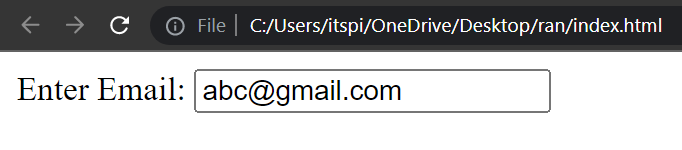
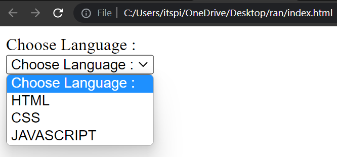
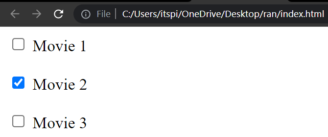

# Forms

Form is an HTML element which is used to take input from user.

```html
<form> => form start
</form> => form end
```

```html
<input type = "text"/> =>input field

type => attribute
```


### How to take input from user

**💻Example :**

```html
<!DOCTYPE html>
<html>
<head>
    <title>Form</title>
</head>
<body>
    <form>
        <input type="text" />
    </form>
</body>
</html>
```
**⚙️ Output :**

 

### Label 

The label is a normal text, its show information about your input element & its visually and pragmatically associated with the input element.

The ```<label>``` tag is used to specify a label for an ```<input>``` element.

**💻Example :**

```html
<!DOCTYPE html>
<html>
<head>
    <title>Forms</title>
</head>
<body>
    <form>
        <label for="inputFullName">Enter FullName: </label> 
        <input type="text" id="inputFullName"/>
    </form>
</body>
</html>
```
**⚙️ Output :**

 


### Password

Password is attribute which is invisible to the user in password field.

**💻Example :**

```html
<!DOCTYPE html>
<html>
<head>
    <title>Forms</title>
</head>
<body>
    <form>
        <label for="inputPassword">Enter Password:</label>
        <input type="password" id="inputPassword"/>
    </form>
</body>
</html>
```
**⚙️ Output :**

 

### Email

The email Attribute is used to validates the text for correct email address. You must use `@` and `.` in this field.

**💻Example :**

```html
<!DOCTYPE html>
<html>
<head>
    <title>Forms</title>
</head>
<body>
    <form>
        <label for="inputEmail">Enter Email:</label>
        <input type="email" id="inputEmail"/>
    </form>
</body>
</html>
```
**⚙️ Output :**

 

📝Note:-  If we do not enter the proper email address then  it will display error like this

**💻Example :**

```html
<!DOCTYPE html>
<html>
<head>
    <title>Forms</title>
</head>
<body>
    <form>
        <label for="inputFullName">Enter FullName: </label> 
        <input type="text" id="inputFullName" required/>

        <br/><br/>

        <label for="inputEmail">Enter Email:</label>
        <input type="email" id="inputEmail" required/>

        <br/><br/>

        <label for="inputPassword" >Enter Password:</label>
        <input type="password" id="inputPassword" required/>

        <br/><br/>

        <input type="submit" value="Register Now"/>
    </form>
</body>
</html>
```
**⚙️ Output :**

 

## Button

There are two type of button <br />
1. Submit button :- it is used to submit form data.
2. Button :- it is used to trigger action.

**💻Example :**

```html
<!DOCTYPE html>
<html>
<head>
    <title>Forms</title>
</head>
<body>
    <form>
        <input type="submit" value="Register Now"/>
    </form>
</body>
</html>
```

**⚙️ Output :**

 


### required 

It is specifies that the element is mandatory to filled out before submitting the form.

**💻Example :**
```html
<!DOCTYPE html>
<html>
<head>
    <title>Forms</title>
</head>
<body>
    <form>
        <label for="inputFullName">Enter FullName: </label> 
        <input type="text" id="inputFullName" required/>

        <br/><br/>

        <label for="inputPassword" >Enter Password:</label>
        <input type="password" id="inputPassword" required/>

        <br/><br/>

        <input type="submit" value="Register Now"/>
    </form>
</body>
</html>
```

**⚙️ Output :**

 

### Placeholder

Placeholder is a attribute which is used to set a short hint that describes the value of an input field. 

**💻Example :**
```html
<!DOCTYPE html>
<html>
<head>
    <title>Forms</title>
</head>
<body>
    <form>
        <input type="text" placeholder="Enter your name"/>
    </form>
</body>
</html>
```
**⚙️ Output :**

 

### Date and Time

**💻Example :**

```html
<!DOCTYPE html>
<html>
<head>
    <title>Forms</title>
</head>
<body>
    <form>
       Date:  <input type="date"/>

       <br/><br/>
       
       Time:  <input type="time"/>
    </form>
</body>
</html>
```
**⚙️ Output :**


### Dropdown 

We can create drop-down list using ```<select>``` tag. ```<select>``` Tag are contain Multiple ```<option>``` tag. ```<option>``` Tag are used to display available options in drop-down.

**Syntax :**

```html
<select>
    <option></option>
    <option></option>
    <option></option>
</select>
```

**Example :**

```html
<!DOCTYPE html>
<html >
<head>
    <title> Checkbox </title>
</head>
<body>
    <form>
        <label for="selectLanguage">Choose Language :</label> <br/>
        <select id="selectLanguage">
            <option> Choose Language :  </option>
            <option> HTML </option>
            <option> CSS </option>
            <option> JAVASCRIPT </option>
        </select>
    </form>
</body>
</html>
```
**Output :**



### Value

The value attribute are used specifies the value of an ```<input>``` element. Value attribute represent the default value for the input element.

**Example :**

```html
<!DOCTYPE html>
<html >
<head>
    <title> Checkbox </title>
</head>
<body>
    <form>
        <label for="motherThoung">Mother Tounge :</label> <br/>
        <input type="text" id="motherThoung" value="ABC"/>
    </form>
</body>
</html>
```
**⚙️ Output :**


### Data List

Data list it is a Searchable list option.
It can help the user, the user does not need to type the whole text data list have predefined suggestions so it can suggest to the user.

**Example :**

```html
<!DOCTYPE html>
<html >
<head>
    <title> Checkbox </title>
</head>
<body>
    <form>
        <input list="techOptions" />

        <datalist id="techOptions">
            <option> Choose Techonoloy :  </option>
            <option> HTML </option>
            <option> CSS </option>
            <option> Javascript </option>
            <option> Bootstrap </option>
            <option> NodeJs </option>
            <option> ExpressJs </option>
        </datalist>
    </form>
</body>
</html>
```
**⚙️ Output :**


### Checkbox 
 
Checkbox is used to multiple selection.

**💻Example :**

```html
<!DOCTYPE html>
<html >
<head>
    <title> Checkbox </title>
</head>
<body>
    <form>
        <input type="checkbox" id="movie1"/>
        <label for="movie1">Movie 1</label> <br/><br/>

        <input type="checkbox" id="movie2"/>
        <label for="movie2">Movie 2</label> <br/> <br/>

        <input type="checkbox" id="movie3"/>
        <label for="movie3">Movie 3</label> <br/><br/>
    </form>
</body>
</html>
```
**⚙️ Output :**



Checkbox have one ```Checked = true``` attribute & this attribute specifies input  element should be pre-selected or checked.

```html
<!DOCTYPE html>
<html >
<head>
    <title> Checkbox </title>
</head>
<body>
    <form>
        <input type="checkbox" id="movie1"  checked="true"/>
        <label for="movie1">Movie 1</label> <br/><br/>

        <input type="checkbox" id="movie2"/>
        <label for="movie2">Movie 2</label> <br/> <br/>

        <input type="checkbox" id="movie3"/>
        <label for="movie3">Movie 3</label> <br/><br/>
    </form>
</body>
</html>
```
**⚙️ Output :**


## Radio Button

Radio Button is used to Single selection.

**💻Example :**
```html
<!DOCTYPE html>
<html >
<head>
    <title> Checkbox </title>
</head>
<body>
    <form>
        <input type="radio" name="gender" id="male"/>
        <label for="male">Male</label><br/>

        <input type="radio" name="gender" id="female"/>
        <label for="female">Female</label>
    </form>
</body>
</html>
```
**⚙️ Output :**


