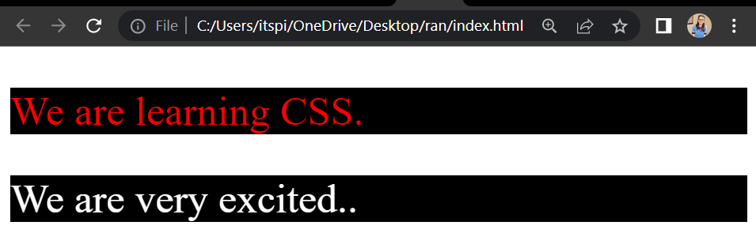

# Introduction To CSS 

## ```CSS``` means Cascading Style Sheets

CSS are Used to Design Your Webpage.
CSS are used to describes how HTML elements are to be displayed on Desktop, laptop, Tablet,screen or in other media.

You can Add CSS in Html elements then use this style tag. 👇

```html
 <style>

 </style>
```

**Example :**

```html
<!DOCTYPE html>
<html >
<head>
    <title> CSS  </title>
    <style>
        h2{
            color : tomato;
        }
    </style>
</head>
<body> 
    <h2> WOW. CSS is beautiful </h2>
</body>
</html>
```
**Explanation :**

```css
      h1{
         color : tomato;
      }
```

```h1```  = Selector <br/>
```{``` = Start <br/>
```color``` = Property <br/>
```:``` =  Seperator <br/>
```blue``` = Declaration <br/>
```;``` = End of value <br/>
```}``` = End <br/>

**⚙️ Output :**

 

### Background-color & font-size

```css
 background-color: tomato;
 font-size: 50px;
```

**Example :**

```html
<!DOCTYPE html>
<html >
<head>
    <title> CSS  </title>
    <style>
        h2{
            color : blue;
            background-color: tomato;
            font-size: 50px;
        }

        p{
            background-color: yellow;
        }
    </style>
</head>
<body> 
    <h2> WOW. CSS is beautiful </h2>
    
    <p>Lorem ipsum dolor sit amet consectetur adipisicing elit. Non at dignissimos commodi sequi alias dolores. Dolorem recusandae alias blanditiis eaque eos maxime voluptatibus qui repellendus, ratione ut, repellat, maiores natus.</p>
</body>
</html>
```
**⚙️ Output :**


## Selectors in CSS 

A CSS selector selects the HTML element you want to style.

Three Types of selectors

1. Tag name
2. Class
3. ID

### Tagname
 Tagname selector select attribute by tag for example ```<h1>```,```<h2>```,```<p>```...
    
  ```html
     <h1> Hii </h1>

     CSS of h1 tag 👉
     
     <style>
     h1{
         color : red
     }
     </style>
 ```

### Classname

The ```.class``` selector selects elements with a specific class attribute.
    
  ```html
    <p class="highlight"> Hii </p>
    <h1 class="highlight"> Hii  </p>

     CSS of class 👉

     <style>
        .highlight{
            background-color : yellow
        }
    </style>
  ```

### ID

   Selects the element with id <br/>

  Example:  ```id="firstname"```

```html
     <h1 id="myheading"> Hii </h1>

     CSS of myheading id 👉
     
     <style>
     #myheading{
         color : red
     }
     </style>

```

**Example :**

```html
<!DOCTYPE html>
<html >
<head>
    <title> CSS  </title>
    <style>
      p{
        color: white;
        font-size: 30px;
        background-color: black;
      }
      
      #description{
        color: red;
        font-size: 30px;
        background-color: black;
      }
    </style>
</head>
<body> 
    <p id="description">We are learning CSS. </p>
    <p>We are very excited..</p>
</body>
</html>
```
**⚙️ Output :**



### Priority in CSS Selectors
When we can provide same effect (like id, class, tag) on particular element then the selector priority as given below. 
In the CSS selector priority of a selector is  High priority for ID, middle priority for class, & low priority for tag.

**Example :**

```html
<!DOCTYPE html>
<html >
<head>
    <title> CSS  </title>
    <style>
     h1{
      color: tomato;
     }

     #xyz{
      color: green;
     }

     .abc{
      color: blue;
     }

    </style>
</head>
<body> 
   <h1 class="abc" id="xyz">
    This is heading
   </h1>
</body>
</html>
```
**Output :**


