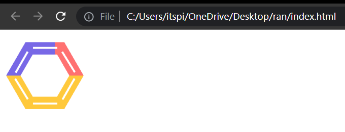
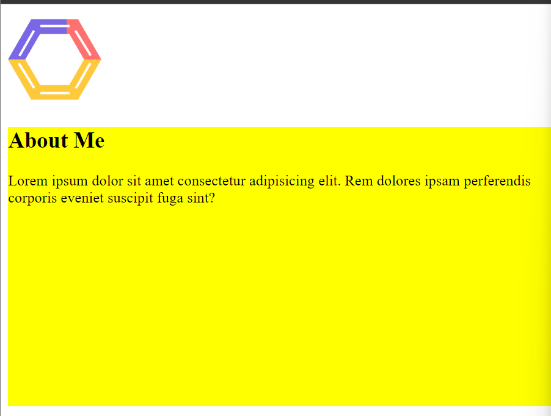
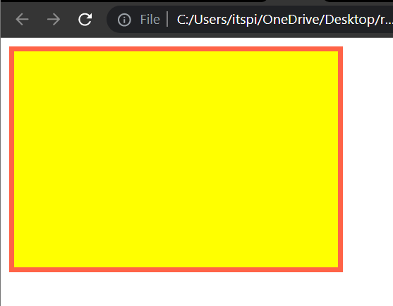

#  Height, Width, Border, Radius in CSS

### Height, Width For Image 

**💻Example :**
```html
<!DOCTYPE html>
<html >
<head>
    <title> CSS  </title>
    <style>
        .rtc-logo{
            height: 100px;
            width: 100px;
        }
    </style>
</head>
<body> 
   
</body>
</html>
```
**⚙️ Output :**



### How to provide height and width to div tag ?

**💻Example :**

```html
<!DOCTYPE html>
<html >
<head>
    <title> CSS  </title>
    <style>
        .rtc-logo{
            height: 100px;
            width: 100px;
        }

        .my-div{
            background-color: yellow;
            width: 600px;
            height: 300px;
        }
    </style>
</head>
<body> 
   

   <div class="my-div">
    <h2>About Me</h2>
    <p>
        Lorem ipsum dolor sit amet consectetur adipisicing elit. Rem dolores ipsam perferendis corporis eveniet suscipit fuga sint?
    </p>
   </div>
</body>
</html>
```
**⚙️ Output :**



## Border

CSS Border have different Properties like border style, border color, border width, border radius.

There are four types of border

1. ```solid``` : ________________
2. ```dotted``` : .................
3. ```dashed``` : ----------
4. ```double``` : =======

**Syntax :**

```css
selector{
    border-style: solid;
    border-color: black;
    border-width: 5px;
}
```

**💻Example :**
```html
<!DOCTYPE html>
<html >
<head>
    <title> CSS  </title>
    <style>
        .box{
            background-color: yellow;
            height: 200px;
            width: 300px;
            border-style: solid;
            border-color: tomato;
            border-width: 5px;
        }
    </style>
</head>
<body> 
   <div class="box">

   </div>
</body>
</html>
```
**Output :**




**Example :**

```html
<!DOCTYPE html>
<html >
<head>
    <title> CSS  </title>
    <style>
        .box{
            background-color: yellow;
            height: 200px;
            width: 300px;
            border-style: double;
            border-color: black;
            border-width: 10px;
        }
    </style>
</head>
<body> 
   <div class="box">

   </div>
</body>
</html>
```
**Output :**


 We Can also Provide Border properties like this ```border: solid black 2px;```

**Example :**

```html
<!DOCTYPE html>
<html>
<head>
    <title></title>
    <style>
        .container{
            background-color: tomato;
            width: 400px;
            height: 100px;
            border: solid black 2px;
        }
    </style>
</head>
<body>
    <div class="container">
        <h2>This is a container</h2>
        <br/>
        This is a container description
    </div>
</body>
</html>
```
**⚙️ Output :**


## Border Radius

Border Radius Property are used to provide radius of element coners.

We can Provide four value to this property. 

Example: 

```border-radius: 0px 50px 0px 50px ;``` 

First value applies to top-left corner, second value applies to top-right cornar, third value applies to bottom-right corner, and fourth value applies to bottom-left corner.

**💻Example :**
```html
<!DOCTYPE html>
<html>
<head>
    <title></title>
    <style>
        .btn{
            width: 350px;
            height: 80px;
            background-color: tomato;
            color: white;
            font-size: 40px;
            border-radius: 50px;
        }
    </style>
</head>
<body>
    <button class="btn">Submit</button>
</body>
</html>
```
**⚙️ Output :**


**💻Example :**
```html
<!DOCTYPE html>
<html>
<head>
    <title></title>
    <style>
        .btn{
            width: 300px;
            height: 80px;
            background-color: tomato;
            color: white;
            font-size: 40px;
            border-radius: 0px 50px 0px 50px ;
        }
    </style>
</head>
<body>
    <button class="btn">Submit</button>
</body>
</html>
```
**⚙️ Output :**


