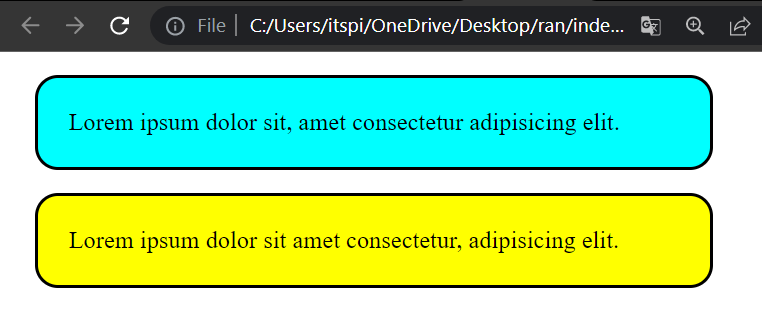
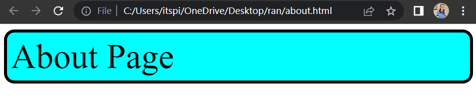

# There are three ways to add CSS

1. ```Document level / Internal CSS```
2. ```Inline CSS => single element```
3. ```External CSS```


### Document level
 
Document level CSS used ```<style>``` element in the ```<head>``` section.


**Example :**

```css
<head>
    <style>
        .box{
            width: 400px;
            padding: 20px;
            border: 2px solid black;
            margin: 15px;
            border-radius: 15px;
     }
    </style>
</head>
```

**Example :**

```html
<!DOCTYPE html>
<html>
<head>
    <title>CSS</title>
    <style>
        .box{
            width: 400px;
            padding: 20px;
            border: 2px solid black;
            margin: 15px;
            border-radius: 15px;
     }

     .box-1{
        background-color: aqua;
     }

     .box-2{
        background-color: yellow;
     }
     
    </style>
</head>
<body>
    <div class="box box-1">
        Lorem ipsum dolor sit, amet consectetur adipisicing elit. 
    </div>
    <div class="box box-2">
     Lorem ipsum dolor sit amet consectetur, adipisicing elit.
    </div>
</body>
</html>
```




### Inline CSS

Inline CSS are using the style attribute inside HTML elements.It is used to give CSS for individual HTML tags.


**Example :**

```css
 <h1 style="background-color: tomato; color: white;">Hello Students</h1>
```

**Example :**

```html
<!DOCTYPE html>
<html>
<head>
    <title>CSS</title>
</head>
<body>
   <h1 style="background-color: tomato; color: white;">Hello Students</h1>
</body>
</html>
```


### External CSS

External CSS are using a ```<link>``` element to link to an external CSS file. We can Provide external link to ```<head>``` Section.

**External Link Example :**

```css
<link rel="stylesheet" href="style.css"/>
```

**Example :**

**File Name : index.html**

```html
<!DOCTYPE html>
<html>
<head>
    <title>Homepage</title>
    <link rel="stylesheet" href="style.css"/>
</head>
<body>
   
    <div class="app-header">Home Page</div>

</body>
</html>
```

**File Name : about.html**

```html
<!DOCTYPE html>
<html >
<head>
    <title>AboutPage</title>
    <link rel="stylesheet" href="style.css"/>
</head>
<body>

    <div class="app-header"> About Page</div>
   
</body>
</html>
```

**File Name : style.css**

```css
.app-header{
    border: 5px solid black;
    padding: 5px;
    font-size: 50px;
    background-color: aqua;
    border-radius: 15px;
}
```

<b>index.html file output </b>


<b>about.html file output </b>


