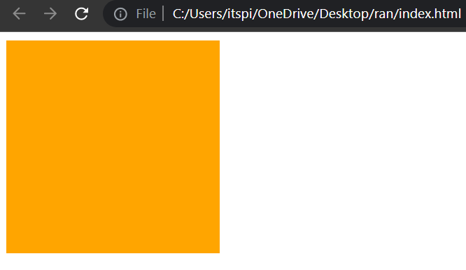
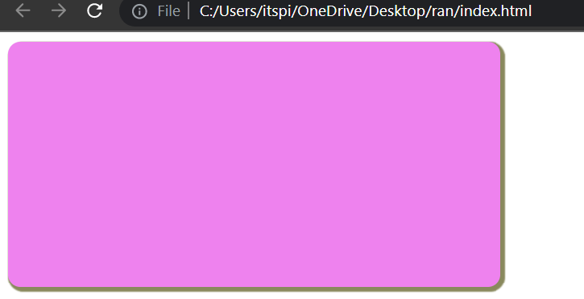

# Hover

The hover selector selects an element when the cursor is over it. Note: The hover selector works on all aspects, not just links.

**Syntax :**

```css
selector {
    //Normal CSS
}

selector:hover{
    //New CSS
}
```

**Example :**

```html
<!DOCTYPE html>
<html >
<head>
    <title> Box Shadow  </title>
    <style>
        .box {
            height: 200px;
            width: 200px;
            background-color: violet;
        }

        .box:hover{
            background-color: orange;
        }
    </style>
</head>
<body> 
   <div class="box">

   </div>
</body>
</html>
```

**⚙️ Output :**




**Example :**

```html
<!DOCTYPE html>
<html >
<head>
    <title> Box Shadow  </title>
    <style>
        .box {
            height: 200px;
            width: 400px;
            background-color: violet;
            border-radius: 10px;
            box-shadow: 2px 2px 1px 2px #89895d;
        }

        .box:hover{
            background-color: orange;
            border-radius: 15px;
            box-shadow: 2px 2px 1px 2px black;
        }
    </style>
</head>
<body> 
   <div class="box">

   </div>
</body>
</html>
```

**⚙️ Output :**




## Text-align

The ```text-align``` CSS property are used to give alignment of text. 

1. ```text-align: start;```

2. ```text-align: end;```

3. ```text-align: center;```

4. ```text-align: justify;```

**Example :**

```html
<!DOCTYPE html>
<html >
<head>
    <title> Box Shadow  </title>
    <style>
        .box {
            background-color: violet;
            color: white;
            text-align: center;
        }
    </style>
</head>
<body> 
   <div class="box">
        Hello World
   </div>
</body>
</html>
```

**Output :**

