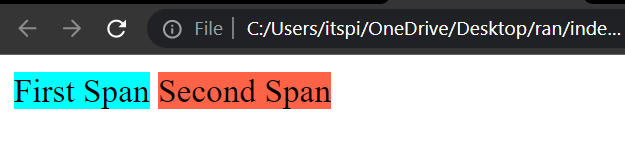
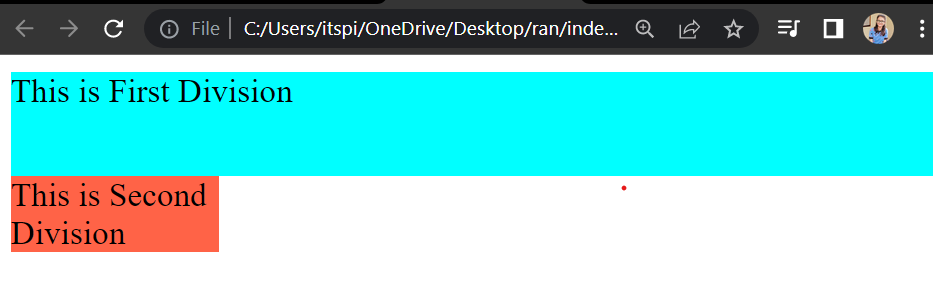

# Inline and Block Properties

`display` property is used to to control the layout. In this guide we will learn about the following display properties:

1. `block`
2. `inline`
3. `inline-block`

## Inline Elements

Inline elements follow the following properties:

1. Inline elements start from same line.
2. `height` and `width` property is not applicable to inline elements.
3. Inline elements take a minimum space required by the content.

Here are some of the inline elements:
`<span>`, `<a>`, ``, `<sub>`, `<sup>`,  `<label>`

**Code:**

```html title="index.html" showLineNumbers="true"
<!DOCTYPE html>
<html >
<head>
    <title> Inline Elements </title>
    <style>
        .span-a{
            background-color: aqua;
        }
        .span-b{
            background-color: tomato;
        }
    </style>
</head>
<body>
   <span class="span-a">First Span</span>

   <span class="span-b">Second Span</span>
</body>
</html>
```

**Output:**



In the following example we are providing `height` and `width` to the inline elements using CSS. But in the output we can see no change in the height and width of the elements.

**Code:**

```html title="index.html" showLineNumbers="true"
<!DOCTYPE html>
<html >
<head>
    <title> Inline Elements </title>
    <style>
        .span-a{
            background-color: aqua;
            height: 100px;
            width: 200px;
        }
        .span-b{
            background-color: tomato;
            height: 100px;
            width: 200px;
        }
    </style>
</head>
<body>
   <span class="span-a">First Span</span>

   <span class="span-b">Second Span</span>
</body>
</html>
```

**Output :**


## Block Elements

Block elements follow the following properties:

1. Start From new line.
2. These elements try to occupy complete space horizontaly.
3. We can specify height and width.

Here are some of the block elements:
`<div>`, `<p>`, `<h1>`, `<h2>`, `<h3>`, `<h4>`, `<h5>`, `<h6>`, `<ul>`, `<ol>`, `<li>`,

**Code:**

```html title="index.html" showLineNumbers="true"
<!DOCTYPE html>
<html>

<head>
    <title> Block Elements </title>
    <style>
        .div-a {
            background-color: aqua;
        }

        .div-b {
            background-color: tomato;
        }
    </style>
</head>

<body>
    <div class="div-a">
        This is First Division
    </div>
    <div class="div-b">
        This is Second Division
    </div>
</body>

</html>
```

In the output we can see that both division are starting from new line. And they are occupying complete space horizontaly. (In the next example we will see how to provide the height and width to the division.)

**Output :**


Now let's see how to provide height and width to the division. We can provide height and width to the division using CSS.

```html title="index.html" showLineNumbers="true"
<!DOCTYPE html>
<html>
<head>
    <title> Block Elements </title>
    <style>
        .div-a {
            background-color: aqua;
            height: 50px;
        }

        .div-b {
            background-color: tomato;
            width: 100px;
        }
    </style>
</head>

<body>
    <div class="div-a">
        This is First Division
    </div>
    <div class="div-b">
        This is Second Division
    </div>
</body>

</html>
```

In the output we can see that the height of the first division is 50px and the width of the second division is 100px.

**Output :**



You might be wondering how to make div elements to start from the same line, also we should be able to provide height and width to the div elements. For this we can use `display: inline-block` property.

## Inline-Block Elements

Elements having display property `inline-block` follows the property of both `inline` and `block` elements. It follows the following properties:

1. `inline-block` elements starts from same line.
2. We can provide height and width to the `inline-block` elements.
3. `inline-block` elements take a minimum space required by the content of this element.

Some inline-block elements are `<button>`, `<input>`

Now we will make display property of division to `inline-block` and let's create two simple cards that are displayed in the same line.

**Code :**

```html title="index.html" showLineNumbers="true"
<!DOCTYPE html>
<html>

<head>
    <title> Inline Block Elements</title>
    <style>
        .card {
            background-color: tomato;
            border: 1px solid black;
            margin: 10px;
            padding: 5px;
            display: inline-block;
            width: 200px;
            height: 250px;
            border-radius: 10px;
            box-shadow: 3px 3px 1px 2px gray;
        }

        .card:hover{
            box-shadow: 3px 3px 1px 2px black;
        }

        .card-heading{
            text-align: center;
        }
    </style>
</head>

<body>
    <div class="card">
        <h1 class="card-heading">HTMl</h1>
    </div>
    <div class="card">
       <h1 class="card-heading">CSS</h1>
    </div>
</body>

</html>
```

**Output:**


## Change Display Property of Elements

We can change the display property of the elements using CSS. For example, we can change the display property of `<span>` element to `block` using CSS.

```css
span{
  display: block;
}
```

In the same way we can change the display property of `<div>` element to `inline` using CSS.

```css
div{
  display: inline;
}
```

:::tip
We can change the display property of any element to any other display property. As per the need you should change the display property of the elements.
:::

## Summary

Here is the quick summary of the display properties of the elements, we have seen in this tutorial:

| Inline | Block | Inline-Block |
| --- | --- | --- |
| Start from new line | Start from new line | Start from same line |
| Take minimum space | Take complete space horizontaly | Take minimum space |
| We can't provide height and width | We can provide height and width | We can provide height and width |
